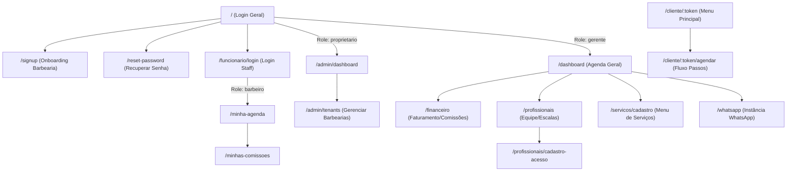

# Arquitetura de Rotas, Componentes e Funções RPC - Navalhado

Este documento descreve o fluxo de navegação e as rotas do frontend da aplicação **Navalhado** (Vite + React), mapeando-as aos perfis de acesso, e detalha as funções remotas (Postgres RPCs) de segurança necessárias para o fluxo de agendamento externo sem login.

> **Estado atual da integração:** a rota `/whatsapp` opera sobre a entidade neutra `public.whatsapp_instances`. O backend usa exclusivamente o adaptador Uazapi; o frontend nunca recebe `instance_token` nem credenciais administrativas. A referência técnica vigente é a [documentação oficial da Uazapi v2.1.1](https://docs.uazapi.com/).

---

## 🗺️ Mapa de Rotas e Componentes (Frontend)

O frontend é desenvolvido como uma Single Page Application (SPA). As rotas administrativas e dos profissionais são protegidas por middlewares que validam o perfil do usuário logado através do token JWT do Supabase Auth.



### 🔓 1. Rotas Públicas & Autenticação

| Rota | Objetivo | Componentes Principais |
| :--- | :--- | :--- |
| `/` | Login geral dos usuários administrativos e gerentes. Redireciona com base no `role` do perfil. | `LoginForm`, `InputEmail`, `InputPassword`, `ForgotPasswordLink` |
| `/funcionario/login` | Login simplificado para profissionais da barbearia (barbeiros) acessarem sua agenda individual. | `LoginFormStaff`, `InputEmail`, `InputPassword` |
| `/signup` | Cadastro de nova barbearia (onboarding do tenant) e seleção de plano inicial. | `TenantRegisterForm`, `PlanSelectorCard`, `SubmitButton` |
| `/reset-password` | Redefinição de senha utilizando o token de recuperação enviado por e-mail. | `TokenInput`, `NewPasswordInput`, `SubmitButton` |

### 👑 2. Rotas do Proprietário (SaaS Admin)

| Rota | Objetivo | Componentes Principais |
| :--- | :--- | :--- |
| `/admin/dashboard` | Visão macro de saúde do SaaS (MRR, inadimplência, novos cadastros). | `MetricCardMRR`, `ActiveTenantsChart`, `RevenueTrendChart` |
| `/admin/tenants` | Gestão de status de ativação, bloqueio e suspensão das barbearias parceiras. | `TenantsTable`, `SearchBar`, `ActivationModal`, `SuspensionModal` |

### 📋 3. Rotas do Gerente (Tenant Admin)

| Rota | Objetivo | Componentes Principais |
| :--- | :--- | :--- |
| `/dashboard` | Agenda diária de todos os profissionais com controle de agendamentos manuais (encaixe). | `WeeklyCalendarGrid`, `BookingDetailsDrawer`, `ManualAppointmentModal` |
| `/financeiro` | Relatórios de faturamento bruto (Dinheiro/PIX/Cartão), líquido e comissões da equipe. | `FinancialSummaryCards`, `CommissionsTable`, `ExportPDFButton` |
| `/profissionais` | Cadastro, escalas e comissões dos barbeiros da equipe. | `ProfessionalsList`, `ScheduleConfigForm`, `CommissionInput` |
| `/profissionais/cadastro-acesso`| Cadastrar credenciais de login e perfil de um barbeiro. | `StaffAccessForm`, `RoleSelectorDropdown` |
| `/servicos/cadastro` | Cadastro e edição dos serviços oferecidos, tempo de execução e comissão por serviço. | `ServiceForm`, `CategorySelect`, `DurationSlider` |
| `/whatsapp` | Ativação, pareamento e operação da Instância WhatsApp do tenant via Uazapi. | `QRCodeDisplay`, `StatusBadge`, `WhatsAppConfigForm`, `DisconnectButton` |

### ✂️ 4. Rotas do Barbeiro (Staff)

| Rota | Objetivo | Componentes Principais |
| :--- | :--- | :--- |
| `/minha-agenda` | Visualização da agenda pessoal do barbeiro, encerramento de atendimentos e cobrança. | `PersonalAgendaGrid`, `CheckOutModal`, `PaymentMethodSelector` |
| `/minhas-comissoes` | Relatório detalhado dos ganhos acumulados por atendimentos realizados. | `CommissionChart`, `AppointmentsHistoryTable` |

### 📱 5. Rotas do Cliente (Acesso por Token Único)

| Rota | Objetivo | Componentes Principais |
| :--- | :--- | :--- |
| `/cliente/:token` | Menu com saudações personalizadas, opções de novo agendamento, reagendamento ou cancelamento. | `GreetingCard`, `ActiveBookingCard`, `CancelBookingDialog` |
| `/cliente/:token/agendar` | Fluxo de agendamento em 3 etapas (Passo 1: Serviço, Passo 2: Profissional, Passo 3: Horário). | `ServiceSelectionGrid`, `StaffCarousel`, `TimeSlotSelector`, `ConfirmationModal` |

---

## 🔒 Funções Remotas (RPC) para Acesso do Cliente

Devido ao uso rigoroso de **Row Level Security (RLS)** nas tabelas públicas, clientes anônimos (`anon`) não podem ler ou escrever diretamente nas tabelas do Supabase. Para contornar esse isolamento com segurança, o frontend do cliente fará chamadas RPC (`security definer`), validando o `token_acesso` nas tabelas antes de devolver ou alterar qualquer registro.

Abaixo estão as especificações lógicas e assinaturas SQL das RPCs seguras:

### 1. Obter Informações do Cliente e Barbearia
Retorna o nome do cliente, o nome da barbearia e as configurações básicas se o token for válido e não tiver expirado.

```sql
create or replace function public.get_customer_info_by_token(p_token uuid)
returns json
language plpgsql
security definer
set search_path = ''
as $$
declare
  v_result json;
begin
  select json_build_object(
    'customer_name', c.name,
    'customer_id', c.id,
    'tenant_id', c.tenant_id,
    'tenant_name', t.name,
    'tenant_logo', t.logo_url
  ) into v_result
  from public.customers c
  join public.tenants t on t.id = c.tenant_id
  where c.token_acesso = p_token
    and (c.token_expirado_em is null or c.token_expirado_em > now());

  if v_result is null then
    raise exception 'Token inválido ou expirado.';
  end if;

  return v_result;
end;
$$;
```

### 2. Listar Serviços Disponíveis
Retorna os serviços ativos da barbearia associada ao token.

```sql
create or replace function public.get_services_by_customer_token(p_token uuid)
returns table(
  id uuid,
  name text,
  description text,
  price numeric,
  duration_minutes integer,
  category text
)
language plpgsql
security definer
set search_path = ''
as $$
declare
  v_tenant_id uuid;
begin
  -- Validar token e capturar tenant_id
  select tenant_id into v_tenant_id
  from public.customers
  where token_acesso = p_token 
    and (token_expirado_em is null or token_expirado_em > now());

  if v_tenant_id is null then
    raise exception 'Acesso negado. Token inválido.';
  end if;

  return query
  select s.id, s.name, s.description, s.price, s.duration_minutes, s.category
  from public.services s
  where s.tenant_id = v_tenant_id
    and s.is_active = true;
end;
$$;
```

### 3. Listar Profissionais Disponíveis
Retorna os profissionais ativos da barbearia.

```sql
create or replace function public.get_professionals_by_customer_token(p_token uuid)
returns table(
  id uuid,
  name text,
  phone text
)
language plpgsql
security definer
set search_path = ''
as $$
declare
  v_tenant_id uuid;
begin
  select tenant_id into v_tenant_id
  from public.customers
  where token_acesso = p_token
    and (token_expirado_em is null or token_expirado_em > now());

  if v_tenant_id is null then
    raise exception 'Acesso negado. Token inválido.';
  end if;

  return query
  select p.id, p.name, p.phone
  from public.professionals p
  where p.tenant_id = v_tenant_id
    and p.is_active = true;
end;
$$;
```

### 4. Consultar Horários Disponíveis por Profissional
Calcula os slots de tempo livres (intervalos de 30 minutos, por exemplo) para um profissional em um dia específico, cruzando sua agenda com os agendamentos existentes.

```sql
create or replace function public.get_available_slots(
  p_token uuid,
  p_professional_id uuid,
  p_date date
)
returns table(slot_start timestamp with time zone, slot_end timestamp with time zone)
language plpgsql
security definer
set search_path = ''
as $$
declare
  v_tenant_id uuid;
  v_day_of_week text;
  v_schedule jsonb;
  v_business_start time;
  v_business_end time;
  v_slot timestamp with time zone;
  v_slot_end timestamp with time zone;
begin
  -- 1. Validar o token e obter o tenant_id
  select tenant_id into v_tenant_id
  from public.customers
  where token_acesso = p_token
    and (token_expirado_em is null or token_expirado_em > now());

  if v_tenant_id is null then
    raise exception 'Acesso negado. Token inválido.';
  end if;

  -- 2. Descobrir o dia da semana e extrair a escala configurada do barbeiro
  v_day_of_week := lower(to_char(p_date, 'day')); -- ex: 'monday', 'tuesday'
  
  select weekly_schedule into v_schedule
  from public.professionals
  where id = p_professional_id and tenant_id = v_tenant_id and is_active = true;

  if v_schedule is null or not (v_schedule ? trim(v_day_of_week)) then
    return; -- Profissional não trabalha neste dia
  end if;

  -- Extrair hora inicial e final de trabalho (ex: {"monday": {"start": "09:00", "end": "18:00"}})
  v_business_start := (v_schedule->trim(v_day_of_week)->>'start')::time;
  v_business_end := (v_schedule->trim(v_day_of_week)->>'end')::time;

  -- 3. Gerar slots de tempo de 30 minutos e filtrar contra agendamentos existentes
  v_slot := p_date + v_business_start;
  while v_slot < (p_date + v_business_end) loop
    v_slot_end := v_slot + interval '30 minutes';

    -- Verificar se o slot conflita com algum agendamento ativo (confirmed ou pending)
    if not exists (
      select 1 from public.appointments
      where professional_id = p_professional_id
        and status in ('confirmed', 'pending')
        and start_time < v_slot_end
        and end_time > v_slot
    ) then
      slot_start := v_slot;
      slot_end := v_slot_end;
      return next;
    end if;

    v_slot := v_slot + interval '30 minutes';
  end loop;
end;
$$;
```

### 5. Criar Agendamento pelo Cliente
Cria o agendamento no banco de dados após a validação do token do cliente.

```sql
create or replace function public.create_appointment_by_token(
  p_token uuid,
  p_professional_id uuid,
  p_service_id uuid,
  p_start_time timestamp with time zone
)
returns uuid
language plpgsql
security definer
set search_path = ''
as $$
declare
  v_tenant_id uuid;
  v_customer_id uuid;
  v_duration integer;
  v_end_time timestamp with time zone;
  v_appointment_id uuid;
begin
  -- 1. Validar o token e obter dados do cliente
  select tenant_id, id into v_tenant_id, v_customer_id
  from public.customers
  where token_acesso = p_token
    and (token_expirado_em is null or token_expirado_em > now());

  if v_tenant_id is null then
    raise exception 'Acesso negado. Token inválido ou expirado.';
  end if;

  -- 2. Obter duração do serviço para computar o horário de fim do agendamento
  select duration_minutes into v_duration
  from public.services
  where id = p_service_id and tenant_id = v_tenant_id and is_active = true;

  if v_duration is null then
    raise exception 'Serviço indisponível ou inexistente.';
  end if;

  v_end_time := p_start_time + (v_duration || ' minutes')::interval;

  -- 3. Prevenir conflito de horário na base
  if exists (
    select 1 from public.appointments
    where professional_id = p_professional_id
      and status in ('confirmed', 'pending')
      and start_time < v_end_time
      and end_time > p_start_time
  ) then
    raise exception 'O horário selecionado acabou de ser reservado. Escolha outro.';
  end if;

  -- 4. Inserir agendamento
  insert into public.appointments (
    tenant_id,
    customer_id,
    professional_id,
    service_id,
    start_time,
    end_time,
    status,
    payment_status
  ) values (
    v_tenant_id,
    v_customer_id,
    p_professional_id,
    p_service_id,
    p_start_time,
    v_end_time,
    'confirmed', -- Cria agendamento já confirmado
    'pending'
  ) returning id into v_appointment_id;

  -- (Opcional) Aqui uma trigger no banco de dados pode registrar uma notificação na fila para envio de WhatsApp.

  return v_appointment_id;
end;
$$;
```

### 6. Cancelar Agendamento pelo Cliente
Permite que o cliente cancele seu próprio agendamento caso precise mudar de planos, informando o motivo.

```sql
create or replace function public.cancel_appointment_by_token(
  p_token uuid,
  p_appointment_id uuid,
  p_reason text
)
returns boolean
language plpgsql
security definer
set search_path = ''
as $$
declare
  v_tenant_id uuid;
  v_customer_id uuid;
begin
  -- 1. Validar o token e obter dados do cliente
  select tenant_id, id into v_tenant_id, v_customer_id
  from public.customers
  where token_acesso = p_token
    and (token_expirado_em is null or token_expirado_em > now());

  if v_tenant_id is null then
    raise exception 'Acesso negado. Token inválido.';
  end if;

  -- 2. Atualizar o agendamento correspondente (garantindo que seja do cliente autenticado pelo token)
  update public.appointments
  set status = 'canceled',
      cancellation_reason = p_reason,
      updated_at = now()
  where id = p_appointment_id
    and tenant_id = v_tenant_id
    and customer_id = v_customer_id
    and status in ('confirmed', 'pending');

  if not found then
    raise exception 'Agendamento não encontrado ou indisponível para cancelamento.';
  end if;

  return true;
end;
$$;
```
