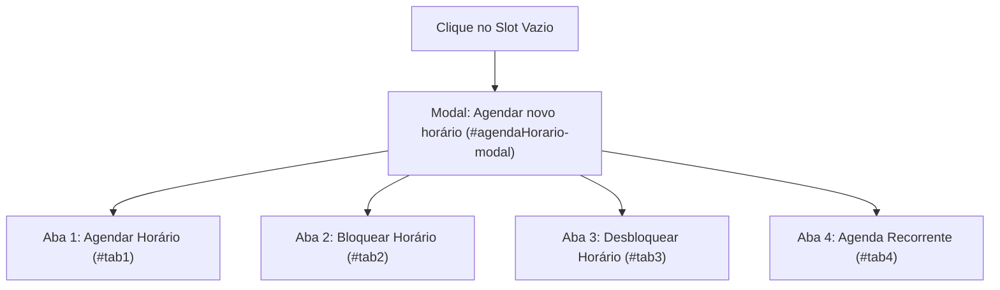
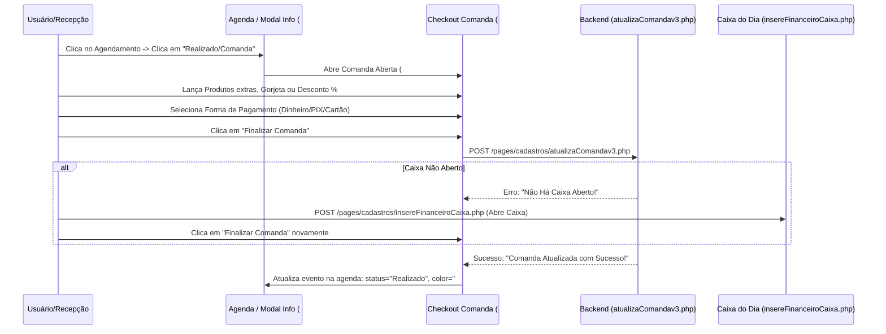

# Engenharia Reversa: Módulo de Agenda, Agendamento e Encaixe (AppBarber)

Este documento é a referência técnica completa e não redundante de todas as funcionalidades da tela de **Agenda** e do **Ciclo de Comandas & Caixa** do sistema AppBarber (`https://sistema.appbarber.com.br/index.php#/agenda`).

---

## 1. Arquitetura e Stack do Frontend

* **Framework Base:** AngularJS 1.x (Controlador da Agenda e Diretivas).
* **Motor de Calendário:** jQuery FullCalendar com extensão `resourceDay` (visão diária em colunas por profissional).
* **Componentes de UI:** Select2 (busca AJAX), Bootstrap 3 Modals, jQuery DataTables, jQuery Timepicker / Datepicker.
* **Alertas & Feedback:** Toastr (notificações flutuantes) e SweetAlert (confirmações).
* **Manipulação de Tempo:** Moment.js configurado para o fuso local (`pt-BR`).
* **Cache Local:** `localStorage.getItem('agenda')` armazena a lista de eventos serializada em JSON para carregamento instantâneo.

---

## 2. Visões Temporais e Barra de Navegação

A barra de navegação superior da agenda gerencia o escopo temporal e a renderização do FullCalendar:

```
[ < ]  [ > ]  [ Hoje ]  [ + Encaixe ]    [ Sábado, 15/Ago/2026 ]    [ Dia ] [ Semana ] [ Mês ]    [ Filtro Profissionais ]
```

| Controle | Função Técnica |
| :--- | :--- |
| **Hoje (`#btnAgendaToday`)** | Executa `gotoDate` para a data atual do servidor/máquina. |
| **Navegação (`prev` / `next`)** | Avança ou recua o dia, semana ou mês ativo. |
| **Visão Dia (`#btnAgendaDay`)** | Ativa a visualização `resourceDay` (uma coluna dedicada para cada profissional ativo). |
| **Visão Semana (`#btnAgendaWeek`)** | Ativa a visualização `agendaWeek` (grade de 7 dias com horários). |
| **Visão Mês (`#btnAgendaMonth`)** | Ativa a visualização `month` (visão global do mês). |
| **Filtro de Profissionais (`#users_menu`)** | Permite isolar um barbeiro específico ou exibir todos lado a lado. Dispara `buscaAgenda3.php` com o ID do profissional. |
| **Mini-Calendário Lateral (`#dvCalendario`)** | Datepicker inline que permite saltar para qualquer data sem paginação sequencial. |

---

## 3. Interação ao Clicar em um Slot Vazio da Grade

Ao clicar em um espaço vago na grade, o sistema avalia o checkbox rápido **`#cbBloqHorario` ("Bloquear Horário")**:

* **Se `#cbBloqHorario` estiver marcado:** O sistema **não abre modal**. Dispara imediatamente `POST /pages/actions/agendaHorarioBloqueado.php`, bloqueando aquele intervalo com 1 clique.
* **Se desmarcado (padrão):** Executa `selecionaHorarioAgenda()`, abrindo o modal central `#agendaHorario-modal` com **4 abas estruturadas**:



### 3.1. Aba 1: `Agendar Horário` (`#tab1`)
* **Campos:** Dia (`#edtData`, travado), Hora Início (`#edtHoraIni`), Profissional (`#edtProfissional`), Serviços dinâmicos (`#servico_menu0` + botão `+ Adicionar serviço`), Cliente (`#cliente_menu` com busca Select2 + botão `+` para cadastro rápido `#btnNovoClienteAg`), Lembretes (SMS e WhatsApp com tempo de antecedência de 5 min a 1 dia), Observações (`#txtObs`).
* **Endpoint:** `POST /pages/cadastros/insereAgendamentov5.php`
* **Payload:** `{ item, tipoitem, profissional, dataagendamento, duracao, cliente, observacao, lembrete, sms, whats, ageorigem: 2 }`
* **Retorno:** `{ erro: "0", agecodigo: "...", comcodigo: "..." }`
* **Estilo Visual:** Laranja (`#f39c12`), classe `.hasmenu`, 100% da largura da coluna.

### 3.2. Aba 2: `Bloquear Horário` (`#tab2`)
* **Campos:** Tipo (*Horário único* ou *Recorrente*), Quantidade de Dias (máx: 180), Periodicidade (máx: 30), Período (Dia/Hora Início e Fim), Profissional Único ou Múltiplos, Observação.
* **Endpoints:**
  * Horário Único: `POST /pages/actions/agendaHorarioBloqueado.php`
  * Recorrente: `POST /pages/cadastros/insereAgendamentoBloqueadoRecorrentev2.php`
* **Estilo Visual:** Cinza Escuro (`#444444`, `codStatus: 6`).

### 3.3. Aba 3: `Desbloquear Horário` (`#tab3`)
* **Campos:** Dia/Hora Início, Dia/Hora Fim e Profissional.
* **Endpoint:** `POST /pages/actions/removeHorarioBloqueado.php`

### 3.4. Aba 4: `Agenda Recorrente` (`#tab4`)
* **Modo Agendar:** Repetição semanal, quinzenal ou mensal (de 1 a 52 ocorrências) para o mesmo cliente/serviço.
* **Modo Cancelar em Lote:** Permite cancelar todos os agendamentos recorrentes de um período determinado.
* **Endpoints:** `POST /pages/cadastros/insereAgendamentoRecorrente.php` / `cancelaAgendamentoRecorrente.php`.

---

## 4. Fluxo de Encaixe (Overbooking Controlado)

* **Gatilho:** Botão superior **`+ Encaixe`** ou menu de contexto -> método `$scope.insereServicoEncaixe()`.
* **Modal:** `#insertServicoEncaixe-modal`.
* **Diferencial:** Os campos de **Profissional**, **Data** e **Hora Início** são seletores livres, permitindo forçar a inserção em horários já ocupados.
* **Endpoint:** `POST /pages/cadastros/insereAgendamentoEncaixev3.php`
* **Payload:** `{ item, tipoitem, profissional, cliente, dia, hora, observacao, ageorigem: 2 }`
* **Retorno:** `{ erro: "0", agecodigo: "..." }`
* **Estilo Visual & Grid Concorrente:**
  * Cor: Marrom (`#795548`), classe `.hasmenu-encaixe`.
  * Grid: Coluna do profissional dividida em 50% para o agendamento normal (esquerda) e 50% para o encaixe (direita).

---

## 5. Ciclo de Vida e Finalização de Comandas (Checkout)

O agendamento no AppBarber nasce intrinsecamente conectado a uma **comanda financeira** (`comcodigo`).



### 5.1. Abertura do Checkout (`#comanda-modal`)
* **Gatilho:** Clicar no botão **"Realizado/Comanda"** (`#btnRealizadoAg`) no modal de informações ou **"Abrir Comanda"** no menu de contexto.
* **Componentes da Comanda:**
  1. **Cabeçalho:** Número da comanda (`idComanda`), Nome do cliente, saldo de pontos de fidelidade (`stringPontosCli`) e campo para leitor de cartão comanda física (`edtComCartao`).
  2. **Itens & Adicionais:**
     * `+ Produto` (`#btnInsereProdutoComanda`): Venda de itens do estoque (pomadas, óleos).
     * `+ Serviço` (`#btnInsereServicoComanda`): Lançamento de serviços adicionais executados na hora.
     * `Gorjeta` (`#btnInsereGorjeta`): Valor destinado ao barbeiro.
     * `% Desconto` (`#btnInsereDesconto`): Desconto percentual ou em valor fixo (R$).
  3. **Múltiplas Formas de Pagamento Dinâmicas:**
     * Suporta divisão de conta (ex: R$ 10,00 Dinheiro + R$ 10,00 PIX).
     * Tipos suportados: `514838` (Dinheiro), `514839` (Cartão de Crédito), `514840` (Cartão de Débito), `514841` (PIX), Assinatura/Clube, Vale Presente, Conta Cliente (Fiado/Débito em conta).
     * Calculadora de Troco automática (`comValorRecebido` e `comValorTroco`).
     * Parcelamento com periodicidade (`selVezesParcela` e `selPeriodicidadeVenda`).

### 5.2. Requisição Técnica de Finalização de Comanda
* **URL:** `POST /pages/cadastros/atualizaComandav3.php`
* **Payload Enviado:**
  ```json
  {
    "comcodigo": "233905774",
    "tipo": 1,
    "valorpagamento": "20.00,",
    "tpacodigo": "514838,",
    "tbacodigo": ",",
    "codtransacao": ",",
    "inserecaixa": 1,
    "inserecontacli": 0,
    "inserecaixinha": 0,
    "parcelado": "0",
    "qtdparcela": "2",
    "periodicidade": "",
    "motivo": "",
    "transacao": "",
    "numpagamento": 1
  }
  ```
* **Regra de Negócio Crítica:** Se `inserecaixa: 1` e não houver um caixa aberto no dia, o backend rejeita a finalização com a mensagem: `{"erro":"1","resultado":"Não Há Caixa Aberto!"}`.
* **Resposta de Sucesso:**
  ```json
  {
    "data": [
      {
        "erro": "0",
        "resultado": "Comanda Atualizada com Sucesso!!"
      }
    ]
  }
  ```

### 5.3. Pós-Finalização (Status "Realizado" / Verde `#5cb85c`)
Após a baixa financeira, o evento na agenda muda de cor para Verde e o modal passa a exibir opções de pós-venda:
* **`Reabrir` (`#btnReabrirAg`):** Estorna o pagamento, reabre a comanda e volta o agendamento para o status `Agendado`.
* **`Comprovante em PDF` (`#trComprovantePDF`):** Emissão de recibo não fiscal em PDF.
* **`Mensagem de Agradecimento` (Menu de contexto):** Disparo de WhatsApp pós-atendimento para avaliação e fidelização.

---

## 6. Módulos e Ferramentas Laterais da Agenda

```
[ Horários Disponíveis ]
[ Lista de Agendamentos ]
[ Lista de Espera ]
[ Produtos / Serviços ]
[ Ver Rodízio ]
[ Caixa / Abrir Caixa ]
```

### 6.1. Consulta de Horários Disponíveis (`#buscaHorariosDisponivel-modal`)
* **Objetivo:** Localiza janelas livres na agenda por profissional, serviço e período.
* **Endpoint:** `POST /pages/cadastros/buscaHorariosDisponiveis.php`.

### 6.2. Lista / Tabela de Agendamentos (`#listaAgendamentoModal-modal`)
* **Objetivo:** Visualização tabular (DataTables) com filtros avançados por Data, Profissional, Serviço e Cliente.

### 6.3. Lista de Espera (`#modalListaEspera-modal` e `#insereClienteListaAgenda-modal`)
* **Objetivo:** Fila de espera diária para remanejamento de desistências e cancelamentos.

### 6.4. Catálogo Rápido de Produtos e Serviços (`#catalogoProduto-modal`)
* **Objetivo:** Consulta ágil da tabela de preços e estoque sem sair da tela de agendamentos.

### 6.5. Rodízio de Profissionais (`#rodizio-modal`)
* **Objetivo:** Fila de atendimento para clientes sem profissional de preferência (*walk-in*).
* **Endpoint:** `GET /pages/cadastros/buscaRodizio.php` (com controle de ordem, status e pausa).

---

## 7. Controle de Caixa Integrado na Agenda

* **Abertura de Caixa (`#cadastrarCaixa-modal`):**
  * **Endpoint:** `POST /pages/cadastros/insereFinanceiroCaixa.php`
  * **Payload:** `FormData { caxData: "15/08/2026", caxValor: "100,00", valor: "100.00", caxObservacao: "Abertura" }`
* **Operações Diárias:** Registro de sangrias, suprimentos e fechamento consolidado (`btnfecharcaixa()`).

---

## 8. Sistema de Cores, Badges e Legenda de Status

| Status / Tipo | Cor Hexadecimal | Classe CSS | Descrição |
| :--- | :---: | :--- | :--- |
| **Agendado** | `#f39c12` (Laranja) | `.hasmenu` | Atendimento confirmado ou aguardando cliente |
| **Encaixe** | `#795548` (Marrom) | `.hasmenu-encaixe` | Atendimento concorrente no mesmo horário |
| **Realizado / Pago** | `#5cb85c` (Verde) | `.fc-event-realizado` | Comanda finalizada e recebida no caixa |
| **Cancelado** | `#dd4b39` (Vermelho) | `.fc-event-cancelado` | Atendimento cancelado / comanda estornada |
| **Ausência (No-Show)** | `#605ca8` (Roxo) | `.fc-event-ausente` | Cliente faltou sem avisar |
| **Bloqueado** | `#444444` (Cinza) | `.fc-event` | Horário travado / indisponível |

### Badges Especiais:
* ⭐ **Clube/Assinante (`#FFD700`):** Cliente de assinatura recorrente.
* 📍 **No Local:** Cliente presente na sala de espera.
* 🔇 **Sem Conversa (`AOp_Sem_Chat: 1`):** Preferência por atendimento silencioso.
* 🏷️ **Tags Coloridas:** Etiquetas customizadas (ex: "VIP", "Primeira Vez").

---

## 9. Esquema do Cache de Eventos (`localStorage['agenda']`)

```json
{
  "id": "339646933",
  "title": "Sem Cadastro - Corte",
  "start": "2026-08-15T11:00:00-03:00",
  "end": "2026-08-15T11:45:00-03:00",
  "Age_Dat_Cadastro": "15/08/2026 15:36 - Jonathas Cerqueira",
  "servico": "Corte",
  "sercodigo": "1339690",
  "status": "Realizado",
  "color": "#5cb85c",
  "obs": "",
  "celular": "",
  "email": "",
  "PAF_CPF": "",
  "usuario": "Sem Cadastro",
  "codStatus": "2",
  "valor": "20,00",
  "resources": "29044142",
  "Age_Origem": "2",
  "Com_Codigo": "233905774",
  "codCliente": "",
  "CIt_Codigo": "284994647",
  "CIt_Pag_Online": "",
  "Encaixe": "0",
  "Age_Confirmado": "0",
  "cupom": "",
  "icon": "",
  "rec": "0",
  "assinatura": "",
  "inadimplente_assinatura": "",
  "ass_multiunidade": "",
  "inadimplente_assinatura_multi": "",
  "AOp_Sem_Chat": "",
  "isAniversario": "0",
  "isPacote": "0",
  "Age_Codigo_Pri_Visita": ""
}
```

---

## 10. Diretrizes para Implementação no Sistema Navalhado

1. **Vínculo Transacional Agendamento ↔ Comanda:**
   * Cada agendamento criado no Navalhado deve gerar imediatamente um registro na tabela `comandas` com `status: "aberta"`.
2. **Validação de Caixa no Checkout:**
   * Impedir recebimentos em dinheiro se a sessão de caixa do dia não estiver com `status: "aberto"`.
3. **Múltiplas Formas de Pagamento e Divisão de Conta:**
   * Suportar pagamentos parciais/divididos em tabela relacional `comanda_pagamentos` (`forma_pagamento_id`, `valor`, `bandeira_id`).
4. **Atualização Reativa em Tempo Real:**
   * Quando uma comanda for finalizada no caixa, o evento correspondente na agenda deve transicionar visualmente para o estado **Realizado** (`#5cb85c`) instantaneamente via Supabase Realtime para todos os operadores conectados.
