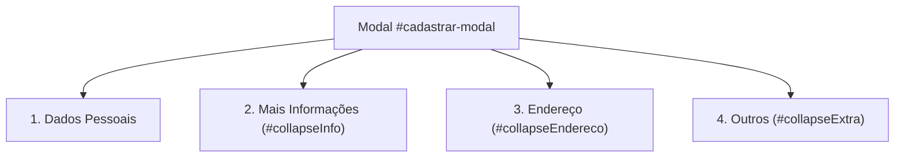
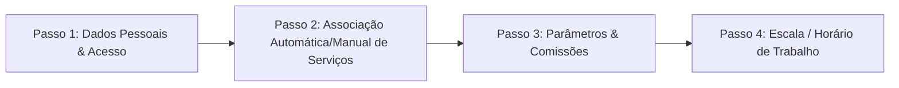
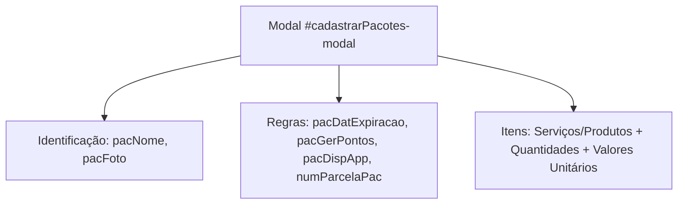

# Engenharia Reversa: Módulo de Cadastros (AppBarber)

Este documento contém a documentação técnica, comportamental e arquitetural de todas as telas, botões de ação, modais, validações, fluxos e requisições AJAX do **Módulo de Cadastros** do AppBarber.

---

# 1. Sub-Módulo: Clientes (`#/clientes`)

* **URL / Estado:** `https://sistema.appbarber.com.br/index.php#/clientes` (`state: clientes`)
* **Controller:** `clientesCtrl`
* **Template:** `/pages/cadastros/clientes.php`

---

## 1.1. Ações do Cabeçalho Superior

| Botão / Elemento | ID / Seletor | Gatilho Técnico | Comportamento e Modal |
| :--- | :--- | :--- | :--- |
| **`+ Cliente`** | `a.btn.bg-teal-dark` | `data-target="#cadastrar-modal"` + `ng-click="limpaLoginSenha()"` | Abre o modal de cadastro de novo cliente limpando campos de login prévios. |
| **`Atualizar`** | `a.btn.bg-teal-dark` | `ng-click="refresh()"` | Executa `atualizaDados()`, recarregando a DataTable de clientes via AJAX sem refresh de página. |
| **`Colunas`** | `.buttons-colvis` | Plugin DataTables Buttons | Abre dropdown para alternar visibilidade de colunas (Telefone, CPF, Pontos, etc.). |
| **`Excel` / `PDF`** | `.buttons-excel`, `.buttons-pdf` | DataTables HTML5 Export | Exporta a listagem filtrada de clientes em arquivo `.xlsx` ou `.pdf`. |

---

## 1.2. Estrutura do Modal de Cadastro (`#cadastrar-modal`)

O modal de cadastro é dividido em 4 seções sanfonadas (Collapse):



### Campos Mapeados:
1. **Dados Pessoais:**
   * `cliNome` (text, obrigatório): Nome completo.
   * `cliCelular` + `cliDialCode` (tel, obrigatório): Telefone móvel com seletor internacional DDI (ex: 55).
   * `cliEmail` (email, opcional): E-mail do cliente (validado regex).
   * `cliLoginId` / `cliSenha` (password, opcional): Criação direta de conta de acesso para o app do cliente.
   * `cliTelefone` (text, opcional): Telefone fixo.
2. **Mais Informações (`#collapseInfo`):**
   * `tipocampoCPFCli` / `cliCpf`: Chaveador entre CPF (11 dígitos) e CNPJ (14 dígitos) com máscara dinâmica.
   * `cliRG`: Documento de identidade.
   * `cliSexo`: Select (Feminino / Masculino).
   * `cliDataNascimento`: Datepicker com data de aniversário (usado para automações de parabéns e cupons).
   * `cliFoto` (`input[type="file"]`): Upload e recorte de foto/avatar do cliente.
   * `cliObservacao`: Notas internas sobre preferências do cliente.
3. **Endereço (`#collapseEndereco`):**
   * `cliPais`, `cliCep`, `cliEndereco`, `cliNumero`, `cliComplemento`, `cliBairro`, `cliEstado`, `cliCidade` (preenchido dinamicamente via `POST /pages/cadastros/buscaCidades.php`).
4. **Outros (`#collapseExtra`):**
   * `cliProfAdi`: Profissional que indicou o cliente.
   * `cliProfCom`: Valor ou porcentagem de comissão perpétua ou pontual paga ao profissional pela indicação.
   * `cliOnde`: Canal de aquisição (ex: Instagram, Google, Indicação, Fachada).

### Requisição de Cadastro:
* **Endpoint:** `POST /pages/cadastros/insereClientes.php`
* **Formato:** `multipart/form-data`
* **Retorno de Sucesso:**
  ```json
  {
    "insereCliente": [
      {
        "erro": "0",
        "resultado": "Cliente cadastrado com sucesso",
        "pescodigo": "29059714"
      }
    ]
  }
  ```

---

## 1.3. Ações da Tabela de Clientes

Cada linha da DataTable renderiza 3 botões de ação rápida:

### 1. Botão `Info` (`#infoCliente-modal`)
Abre a **Central 360º do Cliente** contendo 6 abas completas:
* **Aba 1: Informações Pessoais:** Exibe saldo de pontos, cadastro, endereço e contatos.
* **Aba 2: Dashboard:** Métricas analíticas do cliente (Total investido, Ticket médio, Frequência média em dias, Serviços mais frequentes, Barbeiros mais procurados).
* **Aba 3: Histórico de Agendamentos:** Tabela de agendamentos realizados, cancelados e faltas, com filtro por período (`cliDatInicioAge` a `cliDatFimAge`).
* **Aba 4: Histórico de Comandas:** Tabela de comandas fechadas com discriminação de itens, valores e formas de pagamento.
* **Aba 5: Pacotes:** Exibe pacotes comprados, sessões consumidas e sessões restantes.
* **Aba 6: Prontuário / Anamnese:** Fichas de evolução estética e avaliações prévias.
* **Ações Internas do Modal Info:**
  * `+ Abrir Comanda`: Inicia uma nova comanda para o cliente.
  * `Enviar WhatsApp`: Dispara API do WhatsApp Web (`https://api.whatsapp.com/send?phone=...`).
  * `Gerar Token`: Abre modal de emissão de voucher.
  * `Ver Movimentações`: Extrato completo de créditos e débitos de pontos.
  * `Detalhes da Conta Cliente`: Extrato de saldo devedor/credor (conta corrente/fiado).

### 2. Botão `Editar` (`#editar-modal`)
* Carrega os dados via `$scope.editarCliente(registro)` e dispara `POST /pages/cadastros/buscaCidades.php` e `buscaClienteTag.php`.
* Permite alterar dados pessoais, contatos, permissões de acesso ao aplicativo, foto de perfil e tags.
* **Endpoint de Atualização:** `POST /pages/cadastros/alteraClientesv3.php`
* **Retorno:** `{"data":[{"erro":"0","resultado":"Dados Alterados com Sucesso"}]}`

### 3. Botão `Excluir` (`#removeClienteConfirm1-modal`)
* **Trava de Segurança Anti-Clique:** Ao abrir o modal, o botão de confirmação permanece oculto por um contador regressivo (`#numSegundosAguardoCliente`), exibindo *"Para confirmar aguarde..."* antes de habilitar a exclusão.
* **Endpoint de Exclusão:** `POST /pages/cadastros/removeClientes.php` com payload `{ pescodigo }`.
* **Retorno de Sucesso:** `"0"`.

---

## 1.4. Recursos Especiais de Clientes

### A. Sistema de Tags Coloridas
* Permite categorizar clientes visualmente (ex: "VIP", "Barba Longa", "Exigente").
* **Endpoint de Criação:** `POST /pages/cadastros/insereClienteTag.php` com `{ pescodigo, cor, descricao }`.
* **Endpoint de Consulta:** `POST /pages/cadastros/buscaClienteTag.php`.

### B. Programa de Pontos de Fidelidade
* Permite bonificar o cliente manualmente ou debitar resgates.
* **Endpoint:** `POST /pages/cadastros/inserePessoaPonto.php`
* **Lógica:** Valor positivo (`pontos: 50`) credita; valor negativo (`pontos: -10`) debita do saldo.

### C. Gestão de Acesso ao Aplicativo do Cliente
* Monitora as contas sociais vinculadas pelo cliente no aplicativo móvel:
  * `TLg_Codigo: 1` (E-mail/Senha)
  * `TLg_Codigo: 2 / 3` (Facebook Login)
  * `TLg_Codigo: 4` (Apple ID Login)
  * `TLg_Codigo: 5` (Google Sign-In)
* **Endpoint de Consulta:** `POST /pages/cadastros/CLIENTEBuscaAcessoLista.php`
* **Recuperação de Senha por SMS:** Dispara SMS com link de reset de credenciais.

---

# 2. Sub-Módulo: Profissionais (`#/profissionais`)

* **URL / Estado:** `https://sistema.appbarber.com.br/index.php#/profissionais` (`state: profissionais`)
* **Controller:** `profissionalCtrl`
* **Template:** `/pages/cadastros/profissionais.php`

---

## 2.1. Ações do Cabeçalho Superior

| Botão / Elemento | ID / Seletor | Gatilho Técnico | Comportamento e Modal |
| :--- | :--- | :--- | :--- |
| **`+ Profissional`** | `a.btn.bg-teal-dark` | `data-target="#wizardprof-modal"` | Inicia o Wizard de cadastro em 4 passos. |
| **`Horários de trabalho`** | `button.btn-primary` | `ng-click="displayModalJornada()"` | Abre o gerenciador de escala/turnos de trabalho de todos os profissionais. |
| **`Atualizar`** | `a.btn.bg-teal-dark` | `ng-click="refresh()"` | Recarrega a tabela de profissionais via `buscaProfissionais.php`. |

---

## 2.2. O Wizard de Cadastro de Profissional (`#wizardprof-modal`)



1. **Passo 1: Dados Pessoais & Permissões:**
   * `proNomeWiz` (Nome Completo), `proApelidoWiz` (Nome de Exibição na Agenda/App), `proEmailWiz` (Login), `proCelularWiz` (com DDI), `proCpfWiz`, `proRgWiz`, `proSexoWiz`, `proDataNascimentoWiz`.
   * Checkbox `proGestor`: Concede privilégios administrativos de gestor ao barbeiro.
   * `proFotoWiz`: Upload com crop circular de imagem.
   * **Endpoint:** `POST /pages/cadastros/insereProfissionais_v3.php`
2. **Passo 2: Associação Inteligente de Serviços:**
   * Após o Passo 1, o sistema exibe um SweetAlert perguntando: *"Deseja associar TODOS os serviços automaticamente ou escolher manualmente?"*.
   * Se Automático: Envia array com todos os IDs de serviço para `POST /pages/cadastros/insereServicoProfissional.php`.
3. **Passo 3: Comissões e Tempos Customizados:**
   * Permite definir comissão diferenciada (em % ou R$) e duração de atendimento individual para cada serviço associado ao profissional.
4. **Passo 4: Escala de Trabalho (Jornada Semanal):**
   * Configuração de Turno 1 (Entrada/Saída) e Turno 2 (Entrada/Saída - Almoço) para os dias da semana (Segunda a Domingo).
   * **Endpoint:** `POST /pages/cadastros/insereProfissionalJornada.php`.

---

## 2.3. Modal de Edição Avançada do Profissional (`#editar-modal`)

Ao clicar em **`Editar`** na linha do profissional, o sistema abre o modal completo contendo:
* **Dados Pessoais & Flags de Visibilidade:**
  * `proDispAppEdt`: Exibir ou ocultar o barbeiro no aplicativo do cliente.
  * `proDispAresentacaoEdt`: Exibir ou ocultar no site público / totem de autoatendimento.
* **Tabela de Serviços & Comissões (`#tbServico`):**
  * Edição individual de comissão por serviço (`#editarServico-modal`).
  * **Endpoint:** `POST /pages/cadastros/atualizaServicoProfissional.php`.
* **Tabela de Escala de Trabalho (`#tbJornada`):**
  * Ajuste de turnos por dia da semana (`#alteraHorarioJornada-modal`).
  * **Endpoint:** `POST /pages/cadastros/alteraProfissionalJornadav2.php`.
* **Remunerações Fixas (`#tbRemuneracao`):**
  * Lançamento de salário base ou ajudas de custo mensais fixas (`#editarRemuneracaoProfissional-modal`).
  * **Endpoints:** `POST /pages/cadastros/inserePessoaPagamento.php` e `removePessoaPagamento.php`.
* **Deduções Fixas/Percentuais (`#tbDeducao`):**
  * Descontos regulares sobre os ganhos (ex: taxa de uso de máquina, produtos, uniformes).
  * **Endpoints:** `POST /pages/cadastros/inserePessoaDeducao.php` e `removePessoaDeducao.php`.
* **Controle de Acesso ao Sistema (`#alterarAcesso-modal`):**
  * Redefinição de senha, bloqueio de usuário e controle de tentativas de login.
  * **Endpoint:** `POST /pages/cadastros/alteraAcessoProfissional.php`.

---

## 2.4. Exclusão de Profissional
* **Gatilho:** Botão `Excluir` na DataTable.
* **Endpoint:** `POST /pages/cadastros/removeProfissionais.php` com `{ pescodigo }`.
* **Retorno de Sucesso:** `"0"`.

---

# 3. Sub-Módulo: Serviços & Combos (`#/servicos`)

* **URL / Estado:** `https://sistema.appbarber.com.br/index.php#/servicos` (`state: servicos`)
* **Controller:** `servicosCtrl`
* **Template:** `/pages/cadastros/servicos.php`

---

## 3.1. Ações do Cabeçalho Superior

| Botão / Elemento | ID / Seletor | Gatilho Técnico | Comportamento e Modal |
| :--- | :--- | :--- | :--- |
| **`+ Serviço`** | `a.btn.bg-teal-dark` | `data-target="#cadastrar-modal"` + `ng-click="checkDisponivel()"` | Abre o modal de cadastro de serviço individual. |
| **`Combo`** | `a.btn.bg-teal-dark` | `ng-click="getOptCombo()"` | Abre o assistente de criação de pacotes combo de serviços/produtos. |
| **`Atualizar`** | `a.btn.bg-teal-dark` | `ng-click="refresh()"` | Recarrega a tabela de serviços via `buscaServicos.php`. |

---

## 3.2. Modal de Cadastro de Serviço (`#cadastrar-modal`)

### Campos e Regras de Negócio:
* `serDescricao` (text, obrigatório): Nome do serviço (ex: "Corte Degradê", "Barboterapia").
* `serIntervalo` (select): Duração na grade de horários (de 5 min a 4 horas em intervalos configuráveis).
* `serValor` (text/money, obrigatório): Preço cobrado do cliente.
* `serTipoPreco` (select):
  * `1` ("Igual a"): Preço fixo determinado.
  * `2` ("A partir de"): Preço base com ajuste no caixa conforme a complexidade.
* `serComissao` (text/number): Comissão padrão atribuída ao profissional (em % ou valor monetário).
* `serTempoRetorno` (number): Tempo estimado em dias para o cliente retornar (ex: 15 dias). O sistema usa esse gatilho para disparar o WhatsApp de lembrete com a mensagem cadastrada em `serMenPersonalizada`.
* `serUsaApp` (select 1/0): Disponibilizar para autoagendamento no app do cliente.
* `dispValorApresentacao` (checkbox): Exibir preço no catálogo público do totem/site.
* `serSimultaneos` (number): Quantidade máxima de atendimentos simultâneos permitidos para esse mesmo serviço.
* `serCategoria` (select): Categoria de agrupamento (ex: Cabelo, Barba, Tratamento, Estética).
* `serCusto`: Custo direto de insumos consumidos no procedimento (para cálculo de margem de contribuição líquida).

### Requisição de Cadastro de Serviço:
* **Endpoint:** `POST /pages/cadastros/insereServicosv2.php`
* **Formato:** `multipart/form-data`
* **Retorno:**
  ```json
  {
    "insereServico": [
      {
        "erro": "0",
        "resultado": "Dados Cadastrados com Sucesso",
        "sercodigo": "1340061"
      }
    ]
  }
  ```

---

## 3.3. Modal de Edição Avançada do Serviço (`#editar-modal`)

Ao clicar em **`Editar`** na linha do serviço, o gestor acessa configurações avançadas:

### A. Associação e Comissões por Barbeiro (`#tbProfissionalServico`)
* Permite definir barbeiros habilitados para o procedimento, ajustando tempos e comissões específicas para cada um.
* **Endpoint:** `POST /pages/cadastros/insereProfissionalServico.php`.

### B. Programação de Preços por Dia da Semana (`#tbProgramacaoServico`)
* Permite criar tabelas de preços promocionais dinâmicas (ex: Corte por R$ 25,00 às terças-feiras).
* **Endpoints:** `POST /pages/cadastros/insereServicoValor.php` e `alteraServicoValor.php`.

### C. Descontos por Profissional (`#personalizaDescontoServico-modal`)
* Permite aplicar descontos fixos ou percentuais vinculados a barbeiros específicos (ex: barbeiro júnior com 20% de desconto).
* **Endpoint:** `POST /pages/cadastros/insereServicoDesconto.php`.

### D. Mensagem de Retorno Automatizada (`#mensagemPersonalizadaEdt-modal`)
* Configuração do template de WhatsApp com tags dinâmicas:
  `"Olá {CLIENTE}, você tem Retorno Previsto para o Serviço '{SERVICO}' em {DATA}. Agende agora o seu horário!"`

---

## 3.4. Gestão de Combos (`#cadastrarComboSer-modal`)
* Permite empacotar múltiplos serviços e produtos em um único item comercializável.
* **Endpoints:** `POST /pages/cadastros/insereCombo.php`, `buscaCombo.php`, `atualizaCombo.php`, `removeCombo.php`.

---

## 3.5. Exclusão de Serviço
* **Gatilho:** Botão `Excluir` na DataTable.
* **Endpoint:** `POST /pages/cadastros/removeServicos.php` com `{ sercodigo }`.
* **Retorno de Sucesso:** `"0"`.

---

# 4. Sub-Módulo: Pacotes & Venda de Pacotes (`#/pacotes` e `#/pacotesVenda`)

* **URL / Estado:** `https://sistema.appbarber.com.br/index.php#/pacotes` (`state: pacotes`) e `#/pacotesVenda` (`state: pacotesVenda`)
* **Controllers:** `pacotesCtrl` e `pacotesVendaCtrl`

---

## 4.1. Cadastro de Pacotes (`#cadastrarPacotes-modal`)

Permite a criação de pacotes de sessões pré-pagas (ex: "Pacote 4 Cortes no Mês", "Barba + Corte Quinzenal").



### Campos Mapeados:
* `pacNome` (text, obrigatório): Nome do pacote.
* `pacComissao` (text/money): Comissão padrão do profissional vendedor.
* `pacDatExpiracao` (number): Validade do pacote em dias corridos após a venda.
* `pacGerPontos` (select 1/0): Pontua no programa de fidelidade.
* `pacDispApp` (select 1/0): Permite ao cliente agendar suas sessões direto pelo app.
* `pacDisVendaApp` (select 1/0): Disponibiliza o pacote para compra online pelo cliente.
* `numParcelaPac` (select 1 a 12): Quantidade máxima de parcelas permitidas.
* `itens` (array JSON): Lista de itens contendo `{ tipo, item, qtd, valor }`.

### Requisição de Cadastro de Pacote:
* **Endpoint:** `POST /pages/cadastros/inserePacotes.php`
* **Retorno:**
  ```json
  {
    "result": [
      {
        "erro": "0",
        "resultado": "Pacote Inserido com sucesso!",
        "paccodigo": "149667"
      }
    ]
  }
  ```

---

## 4.2. Checkout de Venda de Pacote (`#/pacotesVenda`)

* **Gatilho:** Botão **`Venda`** (`insereVendaPacote()`) ou botão de ação na listagem.
* **Modal de Venda:** `#cadastrarVendaPacotes-modal`.
* **Proteção contra Duplicidade:** O sistema armazena no `localStorage` a chave `cliente_pacote` impedindo nova venda idêntica acidental dentro da janela de 5 minutos.
* **Múltiplos Pagamentos:** Suporta divisão de conta (ex: 50% PIX e 50% Cartão de Crédito).
* **Integração com Conta Corrente:** Se o valor recebido for inferior ao valor total, registra o saldo restante como débito em conta do cliente via `insereContaCliente()`.
* **Endpoint de Venda:** `POST /pages/cadastros/inserePessoaPacoteTipoPagamentov4.php`
* **Payload Mapeado:**
  ```json
  {
    "pescodigocliente": "29059714",
    "paccodigo": "149667",
    "valorvenda": "70.00,",
    "valorpagamento": "70.00",
    "inserecaixa": 1,
    "tipopagamento": "514841,",
    "tipobandeira": ",",
    "parcelado": "0,",
    "qtdparcelas": "1,",
    "periodicidade": ",",
    "comissao": "10.00",
    "profissionalcomissao": "29044142",
    "expiracao": "30"
  }
  ```

---

## 4.3. Exclusão de Pacote
* **Gatilho:** Botão `Excluir` na DataTable.
* **Endpoint:** `GET /pages/cadastros/removePacotes.php?paccodigo=149667`.
* **Retorno de Sucesso:** `"0"`.

---

# 5. Sub-Módulo: Produtos & Controle de Estoque (`#/estoque`)

* **URL / Estado:** `https://sistema.appbarber.com.br/index.php#/estoque` (`state: estoque`)
* **Controller:** `estoqueCtrl`
* **Template:** `/pages/cadastros/produtos.php`

---

## 5.1. Ações do Cabeçalho Superior

| Botão / Elemento | ID / Seletor | Gatilho Técnico | Comportamento e Modal |
| :--- | :--- | :--- | :--- |
| **`+ Produto`** | `a.btn.bg-teal-dark` | `data-target="#cadastrar-modal"` | Abre o modal de cadastro de novo produto de estoque/venda. |
| **`Fornecedores`** | `a.btn.bg-teal-dark` | `data-target="#fornecedor-modal"` | Abre gerenciador de fornecedores de insumos. |
| **`Adicionar compra ao estoque`** | `a.btn.bg-olive` | `data-target="#inserirnota-modal"` | Lança compras por Nota Fiscal com parcelamento financeiro. |
| **`Transferir entre unidades`** | `#btnTransfereUnidade` | `data-target="#TrasnferirUnidades-modal"` | Remaneja saldo de produtos entre filiais. |
| **`Combo`** | `#btnNovoCombo` | `data-target="#cadastrarCombo-modal"` | Cria kits promocionais de produtos. |
| **`Nova Conferência`** | `#btnGerarInventario` | `ng-click="gerarInventario()"` | Inicia contagem física de estoque para auditoria de inventário. |
| **`Histórico`** | `button.btn-primary` | `ng-click="historicoInventario()"` | Exibe histórico de inventários e ajustes de balanço. |

---

## 5.2. Modal de Cadastro de Produto (`#cadastrar-modal`)

### Campos e Regras de Negócio:
* `proDescricao` (text, obrigatório): Nome do produto (ex: "Pomada Matte 100g").
* `proMarca`: Fabricante/Marca.
* `proCategoria` (select): Categoria de produto (Pomadas, Shampoos, Bebidas, Lâminas).
* `proValor` (text/money): Preço de venda ao consumidor final.
* `proValorProf`: Preço especial de venda para uso interno dos próprios barbeiros.
* `tipoUnidade` (select): Unidade de medida (`UN`, `CX`, `KG`, `LT`, `ML`).
* `proComissao`: Comissão paga ao barbeiro na venda balcão.
* `proFornecedor`: Vínculo com o fornecedor padrão.
* `proQuantidadeMinima`: Ponto de pedido / estoque mínimo para alertas de compra.
* `proDispVenda` (select): Definir se o item é **"Apenas para Uso Interno"** ou **"Disponível para Venda"**.
* `proBarCode`: Código de barras EAN-13 para bipar no leitor óptico do checkout.
* `proObs`: Instruções de armazenagem ou observações.

### Requisição de Cadastro de Produto:
* **Endpoint:** `POST /pages/cadastros/insereProdutov5.php`
* **Retorno:**
  ```json
  {
    "insereProduto": [
      {
        "erro": "0",
        "resultado": "Produto Cadastrado com sucesso! Adicione a ENTRADA no Estoque clicando no botão \"+\" da lista abaixo referente ao Produto!",
        "procodigo": "1071467",
        "descricaoproduto": "Pomada Matte 100g Teste",
        "tipounidade": "1",
        "abreviatura": "un"
      }
    ]
  }
  ```

---

## 5.3. Movimentações Rápidas e Auditoria de Inventário

### A. Entrada / Saída Manual Rápida (`#movEntrada-modal` / `#movSaida-modal`)
* Permite dar entrada de saldo ou registrar perdas, quebras, brindes e consumo de bancada com motivo justificado.
* **Endpoint:** `POST /pages/cadastros/insereMovimentacaoProduto.php`.

### B. Entrada por Compra de Nota Fiscal (`#inserirnota-modal`)
* Permite cadastrar lote de produtos, data de compra, data de emissão, número da NF, fornecedor, quantidade comprada, valor de custo unitário, valor total e número de parcelas financeiras a pagar.
* **Endpoint:** `POST /pages/cadastros/insereProdutoEstoqueViaNota.php`.

### C. Conferência e Inventário Físico (`gerarInventario()`)
* Congela a listagem de saldo teórico para o operador preencher a contagem física real. Ao salvar, calcula divergências (sobras e faltas) e ajusta o estoque gerando log de auditoria.
* **Endpoints:** `POST /pages/cadastros/insereInventario.php` e `buscaHistoricoInventario.php`.

---

## 5.4. Exclusão de Produto
* **Gatilho:** Botão `Excluir` na DataTable.
* **Endpoint:** `GET /pages/cadastros/removeProdutos.php?procodigo=1071467`.
* **Retorno de Sucesso:** `"0"`.

---

# 6. Sub-Módulos Auxiliares: Tipos, Formas de Pagamento & Anamnese

---

## 6.1. Formas de Pagamento & Bandeiras (`#/tipopagamentos` e `#/tipoBandeira`)
* **Gerenciamento de Tipos:** Dinheiro, PIX, Cartão de Crédito, Cartão de Débito, Vale, Cheque, Assinatura.
* **Taxas e Prazos:** Configuração de taxas percentuais cobradas pela adquirente e prazo de compensação em dias para projeção do fluxo de caixa.
* **Regra de Integração:** Flag para lançar ou não automaticamente no Caixa do dia (`inserecaixa: 1`).
* **Endpoints:** `POST /pages/cadastros/insereTipoPagamentos.php`, `atualizaTipoPagamentos.php`, `insereTipoBandeira.php`.

---

## 6.2. Fichas de Anamnese & Avaliação Clínica/Estética (`#/tipoAnamnese`)
* **Objetivo:** Criador de questionários dinâmicos para registro de evolução estética de barba, couro cabeludo e pele.
* **Campos:** Descrição da ficha, perguntas personalizadas, tipo de campo (Texto, Sim/Não, Múltipla Escolha).
* **Endpoints:** `POST /pages/cadastros/insereTipoAnamnese.php`, `buscaTipoAnamnese.php`, `removeTipoAnamnese.php`.

---

## 6.3. Categorias, Despesas, Receitas & Sub-Contas
* **Categorias (`#/categorias`):** Agrupadores de serviços e produtos para relatórios de DRE.
* **Plano de Contas Financeiro (`#/despesas` e `#/receitas`):** Classificação contábil (Aluguel, Água/Luz, Folha, Marketing).
* **Sub-Contas / Caixas Bancários (`#/subcontas`):** Mapeamento de contas bancárias (Itaú, Bradesco, NuBank, Cofre Físico, Carteira Digital).

---

# 7. Sub-Módulo: Clubes de Assinatura (`#/assinaturas` e `#/assinantes`)

* **URL / Estado:** `https://sistema.appbarber.com.br/index.php#/assinaturas` (`state: assinaturas`)
* **Controller:** `assinaturasCtrl`

---

## 7.1. Configuração de Planos Recorrentes
* **Wizard do Plano:**
  1. **Dados Gerais:** Nome do Plano (ex: "Clube Gold"), Valor Mensal (R$), Periodicidade (Mensal, Trimestral, Anual).
  2. **Serviços & Limites:** Cortes ilimitados ou cota fixa mensal (ex: 4 cortes/mês), barba ilimitada.
  3. **Descontos em Produtos:** Desconto percentual fixo em qualquer item da loja para assinantes.
  4. **Comissões de Barbeiros:**
     * Modelo 1: Rateio de Pote / Fundo Geral proporcional aos atendimentos.
     * Modelo 2: Comissão Fixa por serviço realizado por assinante.
  5. **Multiunidades:** Configuração de abrangência (válido em 1 unidade ou em todas as filiais da rede).
  6. **Cobrança Recorrente Automática:** Tokenização de cartão de crédito via adquirente para cobrança automática no dia do vencimento.
* **Endpoints:** `POST /pages/cadastros/insereAssinatura.php`, `salvaAssinaturaItens.php`, `insereAssinaturaProfissional.php`.

---

# 8. Sub-Módulo: Cupons de Desconto & Mensagens (`#/cupomDesconto` e `#/mensagens`)

* **Cupons Promocionais (`#/cupomDesconto`):**
  * Código do cupom (ex: `PRIMEIRACOMPRA`), Desconto em R$ ou %, Validade, Quantidade máxima de resgates e restrição por serviços ou grupos de clientes.
  * **Endpoints:** `POST /pages/cadastros/insereCupomDesconto.php`, `removeCupomDesconto.php`.
* **Notificações & Lembretes Automatizados (`#/lembretes` e `#/mensagens`):**
  * Disparo automático de confirmação de agendamento (WhatsApp/SMS).
  * Régua de reativação de clientes inativos (ex: 30/60 dias sem visitar).
  * Régua de aniversário com envio de voucher presente.
