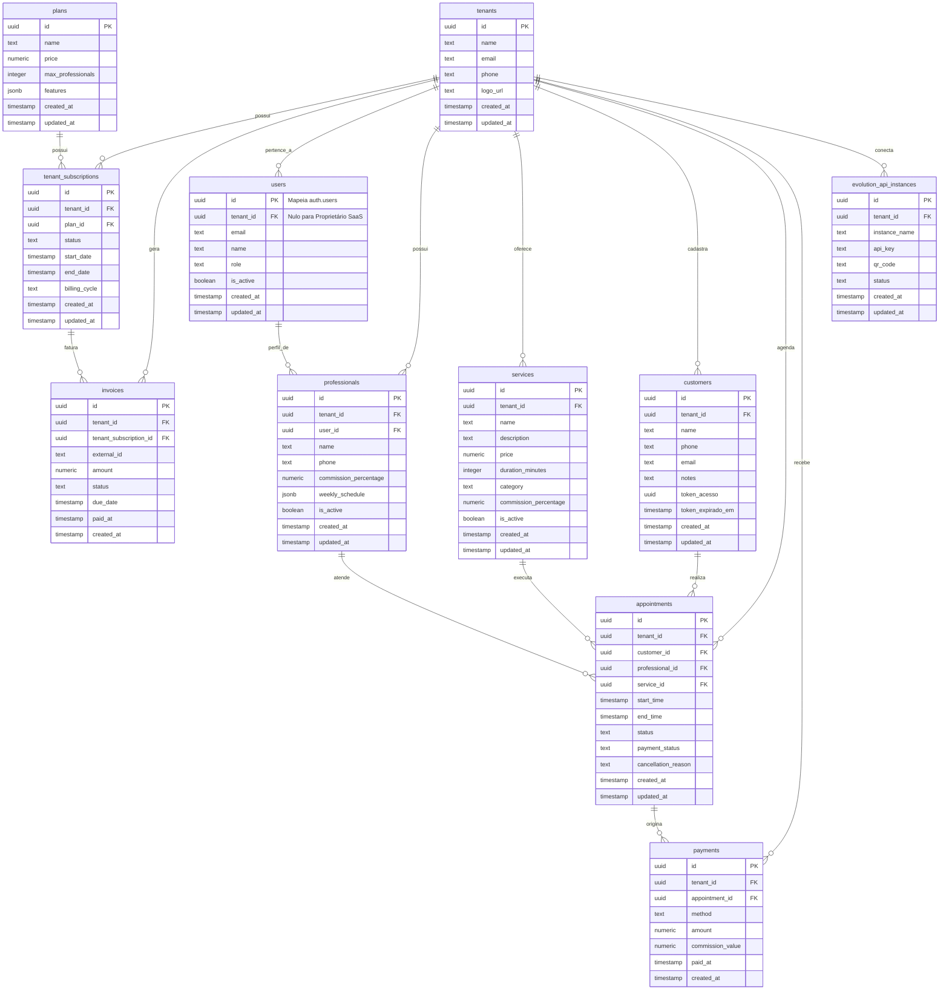

# Modelagem de Banco de Dados e Segurança RLS - Navalhado

Este documento contém a especificação técnica da modelagem do banco de dados relacional para a plataforma **Navalhado**, projetada para ser executada no PostgreSQL do Supabase, aplicando as melhores práticas de Row Level Security (RLS) granular e otimização de consultas.

---

## 📊 Diagrama de Entidade-Relacionamento (ER)

O diagrama abaixo ilustra as tabelas do sistema e suas relações. As linhas contínuas indicam relacionamentos fortes de integridade referencial.



---

## 🛠️ Scripts SQL DDL (Criação de Tabelas e Índices)

Abaixo estão os scripts DDL organizados com chaves primárias UUID geradas automaticamente (`gen_random_uuid()`), chaves estrangeiras apropriadas e índices para garantir performance em joins e filtros de RLS.

```sql
-- Habilitar extensão pgcrypto se necessário para gerar UUIDs
create extension if not exists "pgcrypto";

-- Criar Schema Privado para Helpers e Funções Internas de Segurança (Não exposto na API REST)
create schema if not exists private;

-- =========================================================================
-- 1. TABELAS ADMINISTRATIVAS (SaaS Geral)
-- =========================================================================

-- Tabela: plans
create table public.plans (
    id uuid primary key default gen_random_uuid(),
    name text not null,
    price numeric(10, 2) not null check (price >= 0),
    max_professionals integer not null check (max_professionals > 0),
    features jsonb default '{}'::jsonb,
    created_at timestamp with time zone default timezone('utc'::text, now()) not null,
    updated_at timestamp with time zone default timezone('utc'::text, now()) not null
);

-- Tabela: tenants
create table public.tenants (
    id uuid primary key default gen_random_uuid(),
    name text not null,
    email text not null unique,
    phone text not null,
    logo_url text,
    created_at timestamp with time zone default timezone('utc'::text, now()) not null,
    updated_at timestamp with time zone default timezone('utc'::text, now()) not null
);

-- Tabela: tenant_subscriptions
create table public.tenant_subscriptions (
    id uuid primary key default gen_random_uuid(),
    tenant_id uuid not null references public.tenants(id) on delete cascade,
    plan_id uuid not null references public.plans(id) on delete restrict,
    status text not null check (status in ('active', 'suspended', 'past_due', 'canceled')),
    start_date timestamp with time zone not null,
    end_date timestamp with time zone not null,
    billing_cycle text not null check (billing_cycle in ('monthly', 'yearly')),
    created_at timestamp with time zone default timezone('utc'::text, now()) not null,
    updated_at timestamp with time zone default timezone('utc'::text, now()) not null
);

-- Tabela: invoices
create table public.invoices (
    id uuid primary key default gen_random_uuid(),
    tenant_id uuid not null references public.tenants(id) on delete cascade,
    tenant_subscription_id uuid not null references public.tenant_subscriptions(id) on delete cascade,
    external_id text not null unique,
    amount numeric(10, 2) not null check (amount >= 0),
    status text not null check (status in ('pending', 'paid', 'overdue', 'canceled')),
    due_date timestamp with time zone not null,
    paid_at timestamp with time zone,
    created_at timestamp with time zone default timezone('utc'::text, now()) not null
);

-- =========================================================================
-- 2. TABELAS DO TENANT (Multi-Tenant)
-- =========================================================================

-- Tabela: users (Perfis integrados ao auth.users do Supabase)
create table public.users (
    id uuid primary key references auth.users(id) on delete cascade,
    tenant_id uuid references public.tenants(id) on delete set null, -- Nulo para administradores SaaS globais
    email text not null unique,
    name text not null,
    role text not null check (role in ('proprietario', 'gerente', 'barbeiro')),
    is_active boolean default true not null,
    created_at timestamp with time zone default timezone('utc'::text, now()) not null,
    updated_at timestamp with time zone default timezone('utc'::text, now()) not null
);

-- Tabela: professionals
create table public.professionals (
    id uuid primary key default gen_random_uuid(),
    tenant_id uuid not null references public.tenants(id) on delete cascade,
    user_id uuid references public.users(id) on delete set null,
    name text not null,
    phone text not null,
    commission_percentage numeric(5, 2) not null check (commission_percentage >= 0 and commission_percentage <= 100),
    weekly_schedule jsonb default '{}'::jsonb, -- Configurações de horários diários
    is_active boolean default true not null,
    created_at timestamp with time zone default timezone('utc'::text, now()) not null,
    updated_at timestamp with time zone default timezone('utc'::text, now()) not null
);

-- Tabela: services
create table public.services (
    id uuid primary key default gen_random_uuid(),
    tenant_id uuid not null references public.tenants(id) on delete cascade,
    name text not null,
    description text,
    price numeric(10, 2) not null check (price >= 0),
    duration_minutes integer not null check (duration_minutes > 0),
    category text not null,
    commission_percentage numeric(5, 2) check (commission_percentage >= 0 and commission_percentage <= 100), -- Nulo = usa a comissão do profissional
    is_active boolean default true not null,
    created_at timestamp with time zone default timezone('utc'::text, now()) not null,
    updated_at timestamp with time zone default timezone('utc'::text, now()) not null
);

-- Tabela: customers (Clientes finais de cada barbearia)
create table public.customers (
    id uuid primary key default gen_random_uuid(),
    tenant_id uuid not null references public.tenants(id) on delete cascade,
    name text not null,
    phone text not null,
    email text,
    notes text,
    token_acesso uuid default gen_random_uuid() not null unique,
    token_expirado_em timestamp with time zone,
    created_at timestamp with time zone default timezone('utc'::text, now()) not null,
    updated_at timestamp with time zone default timezone('utc'::text, now()) not null
);

-- Tabela: appointments
create table public.appointments (
    id uuid primary key default gen_random_uuid(),
    tenant_id uuid not null references public.tenants(id) on delete cascade,
    customer_id uuid not null references public.customers(id) on delete restrict,
    professional_id uuid not null references public.professionals(id) on delete restrict,
    service_id uuid not null references public.services(id) on delete restrict,
    start_time timestamp with time zone not null,
    end_time timestamp with time zone not null,
    status text not null check (status in ('pending', 'confirmed', 'completed', 'canceled')),
    payment_status text not null check (payment_status in ('pending', 'paid')),
    cancellation_reason text,
    created_at timestamp with time zone default timezone('utc'::text, now()) not null,
    updated_at timestamp with time zone default timezone('utc'::text, now()) not null
);

-- Tabela: payments
create table public.payments (
    id uuid primary key default gen_random_uuid(),
    tenant_id uuid not null references public.tenants(id) on delete cascade,
    appointment_id uuid not null references public.appointments(id) on delete restrict,
    method text not null check (method in ('Dinheiro', 'PIX', 'Cartão')),
    amount numeric(10, 2) not null check (amount >= 0),
    commission_value numeric(10, 2) not null check (commission_value >= 0),
    paid_at timestamp with time zone default timezone('utc'::text, now()) not null,
    created_at timestamp with time zone default timezone('utc'::text, now()) not null
);

-- Tabela: evolution_api_instances
create table public.evolution_api_instances (
    id uuid primary key default gen_random_uuid(),
    tenant_id uuid not null references public.tenants(id) on delete cascade,
    instance_name text not null unique,
    api_key text not null,
    qr_code text,
    status text not null check (status in ('connected', 'disconnected', 'pairing')),
    created_at timestamp with time zone default timezone('utc'::text, now()) not null,
    updated_at timestamp with time zone default timezone('utc'::text, now()) not null
);

-- =========================================================================
-- 3. ÍNDICES DE PERFORMANCE (Recomendado por Supabase Postgres Best Practices)
-- =========================================================================

-- Índices de chaves estrangeiras (evitam table scan em joins de multi-tenant)
create index idx_tenant_subscriptions_tenant_id on public.tenant_subscriptions(tenant_id);
create index idx_invoices_tenant_id on public.invoices(tenant_id);
create index idx_users_tenant_id on public.users(tenant_id);
create index idx_professionals_tenant_id on public.professionals(tenant_id);
create index idx_professionals_user_id on public.professionals(user_id);
create index idx_services_tenant_id on public.services(tenant_id);
create index idx_customers_tenant_id on public.customers(tenant_id);
create index idx_appointments_tenant_id on public.appointments(tenant_id);
create index idx_appointments_customer_id on public.appointments(customer_id);
create index idx_appointments_professional_id on public.appointments(professional_id);
create index idx_appointments_service_id on public.appointments(service_id);
create index idx_payments_tenant_id on public.payments(tenant_id);
create index idx_payments_appointment_id on public.payments(appointment_id);
create index idx_evolution_api_tenant_id on public.evolution_api_instances(tenant_id);

-- Índices para buscas rápidas e queries recorrentes
create index idx_appointments_start_time on public.appointments(start_time);
create index idx_customers_token_acesso on public.customers(token_acesso);

-- =========================================================================
-- 4. FUNÇÕES DE SUPORTE E TRIGGERS DE SEGURANÇA
-- =========================================================================

-- Trigger de sincronização de auth.users -> public.users
create or replace function public.handle_new_user()
returns trigger
language plpgsql
security definer
set search_path = ''
as $$
begin
  insert into public.users (id, email, name, role, tenant_id, is_active)
  values (
    new.id,
    new.email,
    coalesce(new.raw_user_meta_data->>'name', 'Profissional Novo'),
    coalesce(new.raw_user_meta_data->>'role', 'barbeiro'),
    (new.raw_user_meta_data->>'tenant_id')::uuid,
    true
  );
  return new;
end;
$$;

create or replace trigger on_auth_user_created
  after insert on auth.users
  for each row execute procedure public.handle_new_user();

-- Funções utilitárias privadas para otimização de RLS (Encapsulamento de auth.uid())
create or replace function private.get_auth_tenant_id()
returns uuid
language sql
security definer
set search_path = ''
as $$
  select tenant_id from public.users where id = (select auth.uid());
$$;

create or replace function private.get_auth_role()
returns text
language sql
security definer
set search_path = ''
as $$
  select role from public.users where id = (select auth.uid());
$$;

create or replace function private.is_saas_admin()
returns boolean
language sql
security definer
set search_path = ''
as $$
  select exists (
    select 1 from public.users
    where id = (select auth.uid()) and role = 'proprietario'
  );
$$;

-- Revogar execução pública direta para assegurar sandbox
revoke execute on function private.get_auth_tenant_id() from PUBLIC, anon;
revoke execute on function private.get_auth_role() from PUBLIC, anon;
revoke execute on function private.is_saas_admin() from PUBLIC, anon;

-- =========================================================================
-- 5. POLÍTICAS DE ROW LEVEL SECURITY (RLS) GRANULARES
-- =========================================================================

-- Habilitar RLS em todas as tabelas públicas
alter table public.plans enable row level security;
alter table public.tenants enable row level security;
alter table public.tenant_subscriptions enable row level security;
alter table public.invoices enable row level security;
alter table public.users enable row level security;
alter table public.professionals enable row level security;
alter table public.services enable row level security;
alter table public.customers enable row level security;
alter table public.appointments enable row level security;
alter table public.payments enable row level security;
alter table public.evolution_api_instances enable row level security;

-- Forçar RLS mesmo para proprietários das tabelas (segurança estrita)
alter table public.plans force row level security;
alter table public.tenants force row level security;
alter table public.tenant_subscriptions force row level security;
alter table public.invoices force row level security;
alter table public.users force row level security;
alter table public.professionals force row level security;
alter table public.services force row level security;
alter table public.customers force row level security;
alter table public.appointments force row level security;
alter table public.payments force row level security;
alter table public.evolution_api_instances force row level security;

-- -------------------------------------------------------------------------
-- Tabela: plans
-- -------------------------------------------------------------------------
create policy plans_select_policy on public.plans
  for select to authenticated, anon
  using (true); -- Qualquer um pode visualizar planos (necessário no onboarding)

create policy plans_insert_policy on public.plans
  for insert to authenticated
  with check ((select private.is_saas_admin()));

create policy plans_update_policy on public.plans
  for update to authenticated
  using ((select private.is_saas_admin()));

create policy plans_delete_policy on public.plans
  for delete to authenticated
  using ((select private.is_saas_admin()));

-- -------------------------------------------------------------------------
-- Tabela: tenants
-- -------------------------------------------------------------------------
create policy tenants_select_policy on public.tenants
  for select to authenticated
  using (
    (select private.is_saas_admin()) or 
    id = (select private.get_auth_tenant_id())
  );

create policy tenants_insert_policy on public.tenants
  for insert to authenticated, anon
  with check (true); -- Permitido para cadastros de novos tenants (onboarding)

create policy tenants_update_policy on public.tenants
  for update to authenticated
  using (
    (select private.is_saas_admin()) or (
      id = (select private.get_auth_tenant_id()) and 
      (select private.get_auth_role()) = 'gerente'
    )
  );

create policy tenants_delete_policy on public.tenants
  for delete to authenticated
  using ((select private.is_saas_admin()));

-- -------------------------------------------------------------------------
-- Tabela: tenant_subscriptions
-- -------------------------------------------------------------------------
create policy subscriptions_select_policy on public.tenant_subscriptions
  for select to authenticated
  using (
    (select private.is_saas_admin()) or 
    tenant_id = (select private.get_auth_tenant_id())
  );

create policy subscriptions_insert_policy on public.tenant_subscriptions
  for insert to authenticated
  with check ((select private.is_saas_admin()));

create policy subscriptions_update_policy on public.tenant_subscriptions
  for update to authenticated
  using ((select private.is_saas_admin()));

create policy subscriptions_delete_policy on public.tenant_subscriptions
  for delete to authenticated
  using ((select private.is_saas_admin()));

-- -------------------------------------------------------------------------
-- Tabela: invoices
-- -------------------------------------------------------------------------
create policy invoices_select_policy on public.invoices
  for select to authenticated
  using (
    (select private.is_saas_admin()) or 
    tenant_id = (select private.get_auth_tenant_id())
  );

create policy invoices_insert_policy on public.invoices
  for insert to authenticated
  with check ((select private.is_saas_admin()));

create policy invoices_update_policy on public.invoices
  for update to authenticated
  using ((select private.is_saas_admin()));

create policy invoices_delete_policy on public.invoices
  for delete to authenticated
  using ((select private.is_saas_admin()));

-- -------------------------------------------------------------------------
-- Tabela: users (Perfis Públicos)
-- -------------------------------------------------------------------------
create policy users_select_policy on public.users
  for select to authenticated
  using (
    (select private.is_saas_admin()) or 
    tenant_id = (select private.get_auth_tenant_id())
  );

create policy users_insert_policy on public.users
  for insert to authenticated
  with check (
    (select private.is_saas_admin()) or (
      tenant_id = (select private.get_auth_tenant_id()) and 
      (select private.get_auth_role()) = 'gerente'
    )
  );

create policy users_update_policy on public.users
  for update to authenticated
  using (
    (select private.is_saas_admin()) or (
      tenant_id = (select private.get_auth_tenant_id()) and (
        (select private.get_auth_role()) = 'gerente' or 
        id = (select auth.uid()) -- O próprio usuário pode atualizar seu perfil
      )
    )
  );

create policy users_delete_policy on public.users
  for delete to authenticated
  using (
    (select private.is_saas_admin()) or (
      tenant_id = (select private.get_auth_tenant_id()) and 
      (select private.get_auth_role()) = 'gerente'
    )
  );

-- -------------------------------------------------------------------------
-- Tabela: professionals
-- -------------------------------------------------------------------------
create policy professionals_select_policy on public.professionals
  for select to authenticated
  using (
    (select private.is_saas_admin()) or 
    tenant_id = (select private.get_auth_tenant_id())
  );

create policy professionals_insert_policy on public.professionals
  for insert to authenticated
  with check (
    (select private.is_saas_admin()) or (
      tenant_id = (select private.get_auth_tenant_id()) and 
      (select private.get_auth_role()) = 'gerente'
    )
  );

create policy professionals_update_policy on public.professionals
  for update to authenticated
  using (
    (select private.is_saas_admin()) or (
      tenant_id = (select private.get_auth_tenant_id()) and 
      (select private.get_auth_role()) = 'gerente'
    )
  );

create policy professionals_delete_policy on public.professionals
  for delete to authenticated
  using (
    (select private.is_saas_admin()) or (
      tenant_id = (select private.get_auth_tenant_id()) and 
      (select private.get_auth_role()) = 'gerente'
    )
  );

-- -------------------------------------------------------------------------
-- Tabela: services
-- -------------------------------------------------------------------------
create policy services_select_policy on public.services
  for select to authenticated
  using (
    (select private.is_saas_admin()) or 
    tenant_id = (select private.get_auth_tenant_id())
  );

create policy services_insert_policy on public.services
  for insert to authenticated
  with check (
    (select private.is_saas_admin()) or (
      tenant_id = (select private.get_auth_tenant_id()) and 
      (select private.get_auth_role()) = 'gerente'
    )
  );

create policy services_update_policy on public.services
  for update to authenticated
  using (
    (select private.is_saas_admin()) or (
      tenant_id = (select private.get_auth_tenant_id()) and 
      (select private.get_auth_role()) = 'gerente'
    )
  );

create policy services_delete_policy on public.services
  for delete to authenticated
  using (
    (select private.is_saas_admin()) or (
      tenant_id = (select private.get_auth_tenant_id()) and 
      (select private.get_auth_role()) = 'gerente'
    )
  );

-- -------------------------------------------------------------------------
-- Tabela: customers (Clientes)
-- -------------------------------------------------------------------------
create policy customers_select_policy on public.customers
  for select to authenticated
  using (
    (select private.is_saas_admin()) or 
    tenant_id = (select private.get_auth_tenant_id())
  );

create policy customers_insert_policy on public.customers
  for insert to authenticated
  with check (
    (select private.is_saas_admin()) or 
    tenant_id = (select private.get_auth_tenant_id())
  );

create policy customers_update_policy on public.customers
  for update to authenticated
  using (
    (select private.is_saas_admin()) or 
    tenant_id = (select private.get_auth_tenant_id())
  );

create policy customers_delete_policy on public.customers
  for delete to authenticated
  using (
    (select private.is_saas_admin()) or (
      tenant_id = (select private.get_auth_tenant_id()) and 
      (select private.get_auth_role()) = 'gerente'
    )
  );

-- -------------------------------------------------------------------------
-- Tabela: appointments
-- -------------------------------------------------------------------------
create policy appointments_select_policy on public.appointments
  for select to authenticated
  using (
    (select private.is_saas_admin()) or 
    tenant_id = (select private.get_auth_tenant_id())
  );

create policy appointments_insert_policy on public.appointments
  for insert to authenticated
  with check (
    (select private.is_saas_admin()) or 
    tenant_id = (select private.get_auth_tenant_id())
  );

create policy appointments_update_policy on public.appointments
  for update to authenticated
  using (
    (select private.is_saas_admin()) or 
    tenant_id = (select private.get_auth_tenant_id())
  );

create policy appointments_delete_policy on public.appointments
  for delete to authenticated
  using (
    (select private.is_saas_admin()) or (
      tenant_id = (select private.get_auth_tenant_id()) and 
      (select private.get_auth_role()) = 'gerente'
    )
  );

-- -------------------------------------------------------------------------
-- Tabela: payments
-- -------------------------------------------------------------------------
create policy payments_select_policy on public.payments
  for select to authenticated
  using (
    (select private.is_saas_admin()) or 
    tenant_id = (select private.get_auth_tenant_id())
  );

create policy payments_insert_policy on public.payments
  for insert to authenticated
  with check (
    (select private.is_saas_admin()) or (
      tenant_id = (select private.get_auth_tenant_id()) and 
      (select private.get_auth_role()) in ('gerente', 'barbeiro')
    )
  );

create policy payments_update_policy on public.payments
  for update to authenticated
  using (
    (select private.is_saas_admin()) or (
      tenant_id = (select private.get_auth_tenant_id()) and 
      (select private.get_auth_role()) = 'gerente'
    )
  );

create policy payments_delete_policy on public.payments
  for delete to authenticated
  using (
    (select private.is_saas_admin()) or (
      tenant_id = (select private.get_auth_tenant_id()) and 
      (select private.get_auth_role()) = 'gerente'
    )
  );

-- -------------------------------------------------------------------------
-- Tabela: evolution_api_instances
-- -------------------------------------------------------------------------
create policy instances_select_policy on public.evolution_api_instances
  for select to authenticated
  using (
    (select private.is_saas_admin()) or 
    tenant_id = (select private.get_auth_tenant_id())
  );

create policy instances_insert_policy on public.evolution_api_instances
  for insert to authenticated
  with check (
    (select private.is_saas_admin()) or (
      tenant_id = (select private.get_auth_tenant_id()) and 
      (select private.get_auth_role()) = 'gerente'
    )
  );

create policy instances_update_policy on public.evolution_api_instances
  for update to authenticated
  using (
    (select private.is_saas_admin()) or (
      tenant_id = (select private.get_auth_tenant_id()) and 
      (select private.get_auth_role()) = 'gerente'
    )
  );

create policy instances_delete_policy on public.evolution_api_instances
  for delete to authenticated
  using (
    (select private.is_saas_admin()) or (
      tenant_id = (select private.get_auth_tenant_id()) and 
      (select private.get_auth_role()) = 'gerente'
    )
  );

