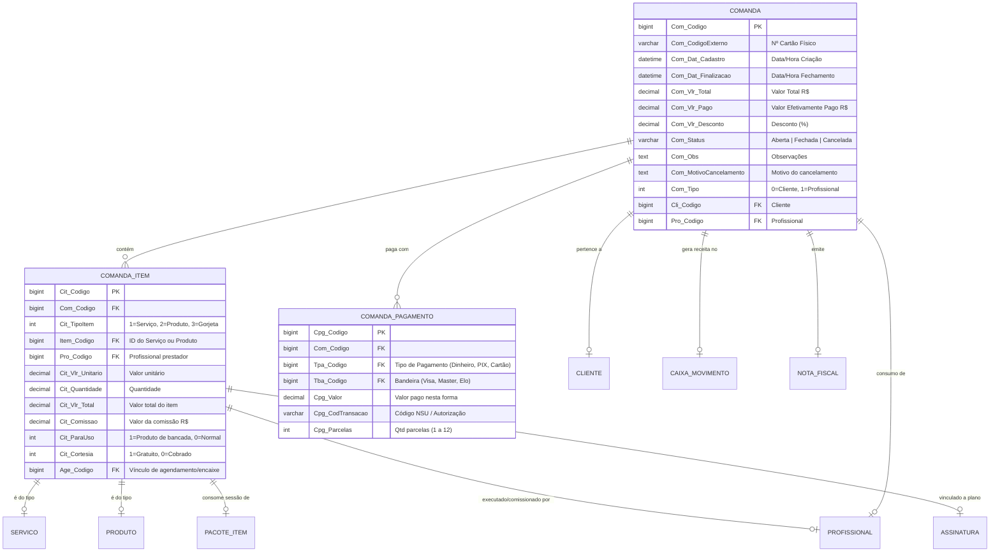

# Mapeamento e Engenharia Reversa Estrutural: Módulo de Comandas (AppBarber)

Este documento apresenta a engenharia reversa completa, mapeamento de protocolos de rede, ciclo de vida da interface, arquitetura de componentes e catálogo exaustivo de endpoints do **Módulo de Comandas** (`#/comandasabertas` e `#/comandashistorico`) do sistema **AppBarber**.

---

## 1. Metadados e Arquitetura da Aplicação

- **Rotas SPA Principais:**
  - `https://sistema.appbarber.com.br/index.php#/comandasabertas` (Comandas Abertas)
  - `https://sistema.appbarber.com.br/index.php#/comandashistorico` (Histórico de Comandas)
- **Títulos das Páginas:**
  - `AppBarber | Comandas Abertas`
  - `AppBarber | Comandas Histórico`
- **Padrão Arquitetural:** Single Page Application (SPA) baseada em **AngularJS 1.4.0** com roteamento via **UI-Router** (`$stateProvider`), carregamento dinâmico via **ocLazyLoad** e manipulação DOM reativa através de **jQuery 3.x**.
- **Controllers AngularJS Envolvidos:**
  - `comandasAbertasCtrl` (`/js/controllers/comandasAbertasCtrl.js`)
  - `comandasHistoricoCtrl` (`/js/controllers/comandasHistoricoCtrl.js`)
  - `sistemaCtrl` (`/js/controllers/sistemaCtrl.js` - gerencia modais globais de itens, pagamentos e finalização de comanda)
- **Design System & Componentes de UI:**
  - AdminLTE 2.x customizado sobre Bootstrap 3.3.x.
  - **DataTables 1.10.x** com extensões `ColVis`, `Buttons` (`excelHtml5`, `pdfHtml5`, `print`), `Moment-sort` e persistência de estado em `localStorage`.
  - **Select2** para busca assíncrona de clientes, serviços, profissionais e pacotes.
  - **Datepicker / Daterangepicker:** `bootstrap-datepicker` e `daterangepicker` com presets dinâmicos (*Hoje*, *Ontem*, *Últimos 7 dias*, *Últimos 30 dias*, *Este Mês*, *Mês Passado*).
  - **Máscaras e Moeda:** `jquery.maskMoney`, `VanillaMasker`, `jquery.inputmask`.
  - **Feedback e Diálogos:** `Toastr`, `SweetAlert` (`swal`) e `jQuery-Impromptu` (`$.prompt`).

---

## 2. Mecanismo de Autenticação e Sessão para Scraping

Para replicar requisições ou criar robôs de extração/sincronização de dados das comandas, o AppBarber exige o contexto de sessão e headers HTTP específicos:

```
┌──────────────────────────────────────────────────────────────────────────────────┐
│                            FLUXO DE AUTENTICAÇÃO DO CLIENTE                      │
├──────────────────────────────────────────────────────────────────────────────────┤
│                                                                                  │
│   1. Cookie de Sessão PHP (PHPSESSID):                                           │
│      • Mantém o token de sessão do usuário autenticado no servidor Apache/PHP.   │
│                                                                                  │
│   2. Identificador do Estabelecimento (APPBLZ_ID / SES_ID):                      │
│      • Hash MD5 único do estabelecimento (ex: c451c801a8f3268c83fdacc1fe7c2baf). │
│      • Enviado via Cookie `APPBLZ_ID` e parâmetro `id` nas chamadas aos serviços.│
│                                                                                  │
│   3. Cabeçalho de Requisição Assíncrona:                                         │
│      • `X-Requested-With: XMLHttpRequest` (obrigatório para DataTables e Ajax). │
│      • `Content-Type: application/x-www-form-urlencoded; charset=UTF-8` ou      │
│        `multipart/form-data` (nos formulários de cadastro com upload).           │
│                                                                                  │
└──────────────────────────────────────────────────────────────────────────────────┘
```

### Cabeçalhos Padrão para Requisições:
```http
User-Agent: Mozilla/5.0 (Windows NT 10.0; Win64; x64) AppleWebKit/537.36 (KHTML, like Gecko) Chrome/120.0.0.0 Safari/537.36
Accept: application/json, text/javascript, */*; q=0.01
X-Requested-With: XMLHttpRequest
Content-Type: application/x-www-form-urlencoded; charset=UTF-8
Cookie: PHPSESSID=<SESSION_ID>; APPBLZ_ID=<ESTABELECIMENTO_HASH_MD5>;
```

---

## 3. Arquitetura de Estados e Ciclo de Vida das Comandas

```
                               ┌─────────────────────────────┐
                               │  #/comandasabertas          │
                               │  (comandasAbertasCtrl)      │
                               └──────────────┬──────────────┘
                                              │
                      ┌───────────────────────┴───────────────────────┐
                      │                                               │
             [+ Nova Comanda]                                 [Clique na Tabela]
                      │                                               │
                      ▼                                               ▼
         ┌─────────────────────────┐                     ┌─────────────────────────┐
         │ #cadastrarComanda-modal │                     │ #comanda-modal          │
         │ - Tipo: Cliente/Prof.   │                     │ - Resumo / Logo         │
         │ - Cliente / Profissional│──[Cria Comanda]────►│ - Tabela Itens (#tb...) │
         │ - Data, Hora, Obs       │                     │ - Formas de Pagamento   │
         │ - Nº Cartão Controle    │                     │ - Troco / Resumo        │
         └─────────────────────────┘                     └────────────┬────────────┘
                                                                      │
                      ┌───────────────────────────────────────────────┼───────────────────────────────────────────────┐
                      │                                               │                                               │
                      ▼                                               ▼                                               ▼
         ┌─────────────────────────┐                     ┌─────────────────────────┐                     ┌─────────────────────────┐
         │ #comandaInsertSer-modal │                     │ #comandaInsert-modal    │                     │ #comandaInsereGorjeta-m │
         │ - Serviço               │                     │ - Produto               │                     │ - Valor (R$)            │
         │ - Profissional          │                     │ - Qtd / Valor Unitário  │                     │ - Profissional          │
         │ - Data Início / Hora    │                     │ - Comissão / Profiss.   │                     │ - Salva e recalcula     │
         │ - Insere como Encaixe   │                     │ - "Para Uso" / Cortesia │                     └─────────────────────────┘
         └─────────────────────────┘                     └─────────────────────────┘                                  │
                      │                                               │                                               │
                      └───────────────────────────────┬───────────────┴───────────────────────────────────────────────┘
                                                      ▼
                                         ┌─────────────────────────┐
                                         │ Gestão de Itens e Ações │
                                         │ - #comandaEdit-modal    │
                                         │ - #descontoComanda-modal│
                                         │ - #comandaPacote-modal  │
                                         │ - #comandaAssinatura-m  │
                                         │ - #auxiliar-modal       │
                                         └────────────┬────────────┘
                                                      │
                                                      ▼
                                         ┌─────────────────────────┐
                                         │ #btnFinalizarComanda    │
                                         │ - Valida Total vs Pago  │
                                         │ - Valida Caixa Aberto   │
                                         │ - Split de Pagamento    │
                                         │ - Lança Saldo Conta Cli │
                                         │ - Dispara NFC-e / Cupom │
                                         └────────────┬────────────┘
                                                      │
                                                      ▼
                               ┌─────────────────────────────────────────────┐
                               │  #/comandashistorico                        │
                               │  - Tabela Histórica (#tbBuscaComandasHist)  │
                               │  - #vercomanda-modal (Somente leitura)      │
                               │  - Reabertura / Estorno de Comanda          │
                               │  - Emissão / Cancelamento de NFC-e/NFSe     │
                               │  - Impressão A4 / Térmica Não-Fiscal        │
                               └─────────────────────────────────────────────┘
```

---

## 4. Catálogo Exaustivo de Modais do Módulo de Comandas

Abaixo estão detalhados todos os modais mapeados, seus formulários, campos e gatilhos de exibição.

### 4.1. Modal de Criação de Comanda (`#cadastrarComanda-modal`)
- **ID:** `cadastrarComanda-modal`
- **Título:** `Nova Comanda`
- **Formulário:** `formCadastroComanda`
- **Campos:**
  1. `comTipoManual` (`<select>`): `0` = Cliente (Atendimento/Venda), `1` = Consumo de Profissional.
  2. `comCliente` (`<select class="select2">`): ID do cliente cadastrado ou `0` para "Sem Cadastro". Possui botão integrado `+ Novo` que dispara `#cadastrarClienteComanda-modal`.
  3. `comProfissional` (`<select class="select2">`): ID do profissional (exibido apenas se `comTipoManual == 1`).
  4. `comandaAbreData` (`<input class="datepicker">`): Data de abertura (`DD/MM/YYYY`).
  5. `comandaAbreHora` (`#horaComandaInicio` `<select class="select2">`): Horário inicial em intervalos de 15 minutos (`00:00` a `23:45`).
  6. `comObs` (`<textarea>`): Observações textuais internas.
  7. `comNumCartao` (`<input type="text">`): Número físico do cartão de controle da barbearia.
- **Ações:** `Abrir Comanda` (submit), `Limpar` (reset), `×` (fechar).

### 4.2. Modal Principal da Comanda (`#comanda-modal`)
- **ID:** `comanda-modal` (Classe `appblz-modal-lg`)
- **Componentes do Cabeçalho:**
  - Logo da barbearia e dados cadastrais (`#enderecoEstabelecimento`, `#nomeSalao`, `#infoSalao`).
  - Número da Comanda (`#idComanda`), Código Externo (`#idComandaExterno`), Data (`#dataComanda`).
  - Campo editável de Cartão de Controle (`#edtComCartao` + `#btnComCartao` para salvamento rápido via `/pages/cadastros/atualizaComandav3.php`).
- **Painel do Cliente:**
  - Identificador do tipo (`#labelTipoClienteComanda`: "Cliente:" ou "Profissional:").
  - Nome do Cliente (`#nomeClienteComanda`) + Ícone de detalhes (`#iconInfoCliente` -> abre `#infoCliente-modal`).
  - Botão `Associar` (`#btnAssociaClienteComanda` -> abre `#associaClienteComanda-modal`).
  - Pontos de Fidelidade (`#stringPontosCli`).
  - Saldo em Conta / Crédito / Débito (`#pessoaConta`).
  - Assinaturas / Planos Ativos (`#pessoaDetalhesAssinaturas`).
- **Barra de Ferramentas / Ações:**
  - `+ Produto` (`#btnInsereProdutoComanda` -> abre `#comandaInsert-modal`).
  - `+ Serviço` (`#btnInsereServicoComanda` -> abre `#comandaInsertSer-modal`).
  - `+ Gorjeta` (`#btnInsereGorjeta` -> abre `#comandaInsereGorjeta-modal`).
  - `% Desconto` (`#btnInsereDesconto` -> abre `#descontoComanda-modal`).
  - Dropdown Impressão: *Impressão A4*, *Impressão Não-Fiscal*, *Enviar E-mail*.
- **Tabela de Itens (`#tbComandaItens`):**
  - Colunas: `Tipo` (Ícone), `Valor`, `Valor Un.`, `Qtd`, `Item`, `Profissional`, `P/ Uso`, `Ações` (Auxiliar, Editar, Pacote, Excluir).
- **Painel Inferior de Pagamento & Fechamento:**
  - **Formas de Pagamento (`#variostiposdepagamento`):** Linhas dinâmicas com Tipo de Pagamento (`#tipoPagamentoX`), Bandeira (`#divBandeiraPagX`), Valor Pago (`#valorPagamentoX`), Código de Transação (`#btnCodigoTransacX`), Remover Linha. Suporta até 2 meios de pagamento divididos (*split payment*).
  - **Totalizadores:** Total da Comanda (`#valorTotalComanda`), Valor Pagamento (`#comValorTotal`).
  - **Flags Financeiras:**
    - Inserir no Caixa (`#insereCaixa` checkbox).
    - Parcelado (`#parcelarCaixa` checkbox): habilita `#selVezesParcela` (1x até 12x) e `#selPeriodicidadeVenda` (7, 15, 30 dias).
  - **Calculadora de Troco:** Campo Recebido (`#comValorRecebido`) com máscara monetária e Troco em tempo real (`#comValorTroco`).
  - **Botões Finais:** `Finalizar Comanda` (`#btnFinalizarComanda`), `Fechar` (`#btnFecharComanda`), `Conta Digital` (`#btnCobrarCliente`).

### 4.3. Modal de Inserção de Produto (`#comandaInsert-modal`)
- **ID:** `comandaInsert-modal`
- **Título:** `Inserir Novo Produto`
- **Formulário:** `formInsereItemComanda`
- **Campos:**
  - `comProduto`: Select do catálogo de produtos.
  - `comValorHdInsert`: Valor unitário (editável).
  - `comValorInsert`: Valor total calculado (`Valor Unitário × Qtd`).
  - `comQtdeInsert`: Quantidade numérica (mínimo 1) com unidade de medida associada.
  - `comTokenInsert` + Botão `Validar`: Validação de token promocional.
  - `comProfissionalComissao`: Seleção do profissional que receberá comissão pela venda.
  - `comProComissao`: Valor monetário da comissão calculada.
  - `comParaUsoInsert` (Checkbox): Produto para uso interno na bancada (não cobrado do cliente, gera baixa no estoque e habilita `#listServicoComanda` para vincular ao serviço correspondente).
  - `comCortesiaInsert` (Checkbox): 100% de desconto no item.

### 4.4. Modal de Inserção de Serviço (`#comandaInsertSer-modal`)
- **ID:** `comandaInsertSer-modal`
- **Título:** `Inserir Novo Serviço`
- **Formulário:** `formInsereItemComandaSer`
- **Campos:**
  - `comInsertServico`: Select do serviço (com `data-valor` e `data-tipoitem`).
  - `comInsertProfissional`: Seleção do profissional prestador.
  - `comDataIni`: Data da execução do serviço.
  - `comHoraIni`: Horário do serviço.
  - **Aviso de Encaixe:** Inserções diretas pela comanda entram como encaixe, dispensando validação de choque de horários na grade da agenda.

### 4.5. Modal de Edição de Item (`#comandaEdit-modal`)
- **ID:** `comandaEdit-modal`
- **Formulário:** `formAlteraItemComanda`
- **Campos:**
  - `comValorHd`: Valor unitário ajustável.
  - `comValor`: Valor total resultante.
  - `comQtde`: Quantidade.
  - `comComissao`: Comissão customizada.
  - `comToken` / `comCupom`: Validação de vouchers e cupons de desconto (`validaCupomComanda.php`).
  - `comParaUso` / `comCortesia`: Alternadores de produto de bancada ou gratuidade.
  - `dataCamandaAlteracao` / `horaComandaAlteracao`: Reagendamento da data/hora do serviço diretamente na comanda.

### 4.6. Modal de Desconto Geral (`#descontoComanda-modal`)
- **ID:** `descontoComanda-modal`
- **Título:** `Desconto`
- **Campos:** `comValorDesconto` (Percentual `%` de desconto aplicado sobre o total da comanda).
- **Proteção:** Suporta validação prévia de senha de gerente (`/php/verificaSenhaDesconto.php`).

### 4.7. Modal de Gorjeta (`#comandaInsereGorjeta-modal`)
- **ID:** `comandaInsereGorjeta-modal`
- **Título:** `Gorjeta`
- **Campos:** `valorComandaGorjeta` (Valor monetário R$) e `profissionalGorjeta` (Profissional beneficiário).

### 4.8. Modal de Cancelamento de Comanda (`#cancelarComanda-modal`)
- **ID:** `cancelarComanda-modal`
- **Título:** `Cancelar Comanda`
- **Formulário:** `formCancelaComanda`
- **Campos:** `codigoComandaCancelamento` (ID oculto da comanda) e `comMotivo` (Justificativa obrigatória do cancelamento).

### 4.9. Modal de Associação de Cliente (`#associaClienteComanda-modal`)
- **ID:** `associaClienteComanda-modal`
- **Formulário:** `formAssociaClienteComanda`
- **Campos:** `buscaClienteAssociaComanda` (Select2 com autocomplete assíncrono de clientes).

### 4.10. Modal de Associação de Pacote (`#comandaPacote-modal`)
- **ID:** `comandaPacote-modal`
- **Formulário:** `formAlteraItemPacote`
- **Campos:** `pacotesComandaCombo` (Lista os pacotes contratados pelo cliente), exibindo barra de progresso de consumo (`#pacotesComandaProgress`), saldo de sessões e data de compra.

### 4.11. Modal de Associação a Clube de Assinatura (`#comandaAssinatura-modal`)
- **ID:** `comandaAssinatura-modal`
- **Campos:** Exibe nome do plano, data de vencimento e limite/utilizações restantes do serviço contratado na assinatura recorrente.

### 4.12. Modal de Visualização de Comanda no Histórico (`#vercomanda-modal`)
- **ID:** `vercomanda-modal`
- **Comportamento:** Exibe todos os itens, valores, formas de pagamento, autorizações e status da comanda finalizada em modo somente-leitura.

---

## 5. Catálogo Exaustivo de Endpoints do Módulo de Comandas

Todos os endpoints operam sob o domínio `https://sistema.appbarber.com.br` e recebem requisições com o cookie de sessão autenticado.

---

### 5.1. Abertura de Nova Comanda
- **Endpoint:** `POST /pages/cadastros/insereComandasv2.php`
- **Content-Type:** `multipart/form-data`
- **Payload:**
  | Campo | Tipo | Descrição |
  | :--- | :--- | :--- |
  | `comTipoManual` | String | `0` (Cliente) ou `1` (Consumo de Profissional) |
  | `comCliente` | String | ID do cliente selecionado ou `0` (Sem cadastro) |
  | `comProfissional` | String | ID do profissional (obrigatório se `comTipoManual == 1`) |
  | `comandaAbreData` | String | Data no formato `DD/MM/YYYY` |
  | `comandaAbreHora` | String | Horário no formato `HH:MM` |
  | `comObs` | String | Observações |
  | `comNumCartao` | String | Número do cartão de controle físico |
- **Estrutura de Resposta de Sucesso:**
  ```json
  {
    "result": [
      {
        "erro": "0",
        "resultado": "Comanda cadastrada com sucesso",
        "ComCodigo": "235939934",
        "NomeCliente": "Sem Cadastro",
        "DataComanda": "26/08/2026 09:30",
        "CodigoExterno": "999",
        "Cliente": "0",
        "TPRCodigo": "0"
      }
    ]
  }
  ```

---

### 5.2. Listagem de Comandas Abertas
- **Endpoint:** `POST /pages/cadastros/buscaComandasAbertas.php`
- **Content-Type:** `application/x-www-form-urlencoded`
- **Payload:**
  | Campo | Tipo | Descrição |
  | :--- | :--- | :--- |
  | `dataini` | String | Data inicial (`DD/MM/YYYY`) |
  | `datafim` | String | Data final (`DD/MM/YYYY`) |
- **Estrutura de Resposta:**
  ```json
  {
    "data": [
      {
        "Codigo": "235939934",
        "CodigoExterno": "999",
        "Data": "26/08/2026 09:30",
        "Valor": "60,00",
        "Cliente": "",
        "Obs": "Teste Engenharia Reversa",
        "UsuCadastro": "Erica Fernandes",
        "Profissional": "Erica",
        "btnVer": "<button class='btn btn-default btn-xs'>Ver</button>",
        "btnCancela": "<button class='btn btn-danger btn-xs'>Cancelar</button>"
      }
    ]
  }
  ```

---

### 5.3. Busca de Detalhes e Itens de uma Comanda
- **Endpoint:** `GET /pages/cadastros/buscaItensComanda.php?codigo={COM_CODIGO}`
- **Estrutura de Resposta:**
  ```json
  {
    "data": [
      {
        "Codigo": "5423891",
        "CodItem": "1347654",
        "CodSerPro": "29248105",
        "TipoItem": "1",
        "Item": "Corte",
        "Profissional": "Erica Fernandes",
        "Valor": "50,00",
        "ValorUn": "50,00",
        "Quantidade": "1",
        "TipoUnidade": "un",
        "Desconto": "0,00",
        "ValorTotal": "60,00",
        "comandaVlrPagamento": "60,00",
        "tipoPagamento": "Dinheiro",
        "Cortesia": "0",
        "Uso": "0",
        "ExistePacote": "0",
        "asscodigo": "",
        "btnEditar": "<button class='btn btn-info btn-xs'><i class='fa fa-pencil'></i></button>",
        "btnExcluir": "<button class='btn btn-danger btn-xs'><i class='fa fa-trash'></i></button>"
      }
    ]
  }
  ```

---

### 5.4. Inserção de Serviço na Comanda (Encaixe)
- **Endpoint:** `POST /pages/cadastros/insereItensComandaSer.php` (ou `insereAgendamentoEncaixev3.php`)
- **Payload:**
  | Campo | Tipo | Descrição |
  | :--- | :--- | :--- |
  | `comCodigoInsertSer` | String | ID da Comanda |
  | `comInsertServico` | String | ID do Serviço |
  | `comInsertProfissional` | String | ID do Profissional prestador |
  | `comDataIni` | String | Data (`DD/MM/YYYY`) |
  | `comHoraIni` | String | Horário (`HH:MM`) |
  | `insereServicoOrigem` | String | Origem da chamada (`1` = Comanda) |
- **Resposta:**
  ```json
  {
    "result": [
      {
        "erro": "0",
        "resultado": "Serviço inserido com sucesso"
      }
    ]
  }
  ```

---

### 5.5. Inserção de Produto na Comanda
- **Endpoint:** `POST /pages/cadastros/insereComandaItensV4.php`
- **Payload:**
  | Campo | Tipo | Descrição |
  | :--- | :--- | :--- |
  | `comCodigoInsert` | String | ID da Comanda |
  | `comProduto` | String | ID do Produto |
  | `comValorHdInsert` | String | Valor unitário |
  | `comQtdeInsert` | Number | Quantidade vendida |
  | `comProfissionalComissao` | String | ID do profissional comissionado |
  | `comTokenInsert` | String | Token/Voucher (se houver) |
  | `comParaUsoInsert` | String | `on` ou vazio (Uso interno na bancada) |
  | `listServicoComanda` | String | ID do agendamento vinculado se for para uso |
  | `comCortesiaInsert` | String | `on` ou vazio (100% de desconto) |
- **Resposta:**
  ```json
  {
    "result": [
      {
        "erro": "0",
        "resultado": "Produto inserido com sucesso"
      }
    ]
  }
  ```

---

### 5.6. Inserção e Edição de Gorjeta
- **Endpoint (Inserção):** `POST /pages/cadastros/insereComandaGorjeta.php`
- **Endpoint (Edição):** `POST /pages/cadastros/alteraComandaGorjeta.php`
- **Payload:**
  | Campo | Tipo | Descrição |
  | :--- | :--- | :--- |
  | `comcodigo` | String | ID da Comanda |
  | `profissional` | String | ID do profissional |
  | `valor` | String | Valor monetário da gorjeta (ex: `10,00`) |
- **Resposta:**
  ```json
  {
    "data": [
      {
        "erro": "0",
        "resultado": "Gorjeta inserida com sucesso"
      }
    ]
  }
  ```

---

### 5.7. Aplicação de Desconto Geral na Comanda
- **Endpoint Validação Senha:** `POST /php/verificaSenhaDesconto.php`
  - Payload: `{ "password": "<SENHA>" }`
- **Endpoint Aplicação Desconto:** `POST /pages/cadastros/alteraComandaDesconto.php`
  - Payload: `{ "comanda": "<ID>", "desconto": "<PERCENTUAL>", "senhaDesconto": "<HASH>" }`
- **Resposta:**
  ```json
  {
    "data": [
      {
        "erro": "0",
        "resultado": "Desconto aplicado com sucesso"
      }
    ]
  }
  ```

---

### 5.8. Finalização de Comanda (Checkout / Fechamento)
- **Endpoint:** `POST /pages/cadastros/atualizaComandav3.php`
- **Payload Completo:**
  | Campo | Tipo | Descrição |
  | :--- | :--- | :--- |
  | `comcodigo` | String | ID da Comanda |
  | `tipo` | String | `2` = Finalizar comanda |
  | `insereCaixa` | Number | `1` (lança no caixa do dia) ou `0` |
  | `tipopagamento0` | String | ID da 1ª forma de pagamento |
  | `bandeirapagamento0`| String | ID da bandeira da 1ª forma de pagamento |
  | `valorpagamento0` | String | Valor pago na 1ª forma |
  | `codigotransacao0` | String | Código NSU/Autorização/POS da 1ª forma |
  | `tipopagamento1` | String | ID da 2ª forma de pagamento (se houver) |
  | `bandeirapagamento1`| String | ID da bandeira da 2ª forma |
  | `valorpagamento1` | String | Valor pago na 2ª forma |
  | `codigotransacao1` | String | Código de transação da 2ª forma |
  | `parcelado` | Number | `1` (se venda parcelada) ou `0` |
  | `parcelas` | Number | Número de parcelas (1 a 12) |
  | `periodicidade` | Number | Intervalo em dias (`7`, `15`, `30`) |
  | `troco` | String | Valor de troco devolvido |
- **Resposta:**
  ```json
  {
    "result": [
      {
        "erro": "0",
        "resultado": "Comanda finalizada com sucesso!"
      }
    ]
  }
  ```

---

### 5.9. Cancelamento de Comanda
- **Endpoint:** `POST /pages/cadastros/removeComandas.php`
- **Content-Type:** `multipart/form-data`
- **Payload:**
  | Campo | Tipo | Descrição |
  | :--- | :--- | :--- |
  | `codigoComandaCancelamento` | String | ID da Comanda |
  | `comMotivo` | String | Justificativa textual do cancelamento |
- **Resposta:**
  ```json
  {
    "result": [
      {
        "erro": "0",
        "resultado": "Comanda cancelada com Sucesso."
      }
    ]
  }
  ```

---

### 5.10. Histórico de Comandas e Filtros
- **Endpoint:** `POST /pages/cadastros/buscaComandasHistoricov2.php`
- **Payload:**
  | Campo | Tipo | Descrição |
  | :--- | :--- | :--- |
  | `tipo` | String | `1` (Clientes), `2` (Profissionais/Consumo), `3` (Comanda Específica por número) |
  | `dataini` | String | Data de início (`DD/MM/YYYY`) |
  | `datafim` | String | Data de término (`DD/MM/YYYY`) |
  | `comanda` | String | Número específico da comanda (quando `tipo == 3`) |
- **Resposta:**
  ```json
  {
    "data": [
      {
        "Codigo": "235939934",
        "CodigoExterno": "999",
        "Status": "Cancelada",
        "DataCadastro": "26/08/2026 09:30",
        "Valor": "60,00",
        "Cliente": "",
        "Obs": "Teste Engenharia Reversa",
        "TipoPagamento": "",
        "UsuCadastro": "Erica Fernandes",
        "Profissional": "Erica",
        "UsuFinaliza": "",
        "DataFinaliza": "",
        "DataInsercao": "26/08/2026 09:30",
        "FCaData": "",
        "btnReabrir": "",
        "btnVer": "<button class='btn btn-success btn-xs'>Ver</button>"
      }
    ]
  }
  ```

---

### 5.11. Reabertura / Estorno de Comanda Finalizada
- **Endpoint:** `POST /pages/cadastros/alteraComandaReabrir.php` (ou `atualizaComandav2.php`)
- **Payload:**
  | Campo | Tipo | Descrição |
  | :--- | :--- | :--- |
  | `comcodigo` | String | ID da Comanda |
  | `tipo` | String | `4` = Reabrir Comanda |
- **Resposta:**
  ```json
  {
    "result": [
      {
        "erro": "0",
        "resultado": "Comanda reaberta com sucesso!"
      }
    ]
  }
  ```

---

## 6. Mapeamento de Modelos de Dados e Relacionamentos



---

## 7. Regras de Negócio e Casos de Borda Testados

Durante a bateria de testes automatizados e em tempo real, foram validadas as seguintes regras de negócio críticas:

1. **Validação de Caixa Fechado no Fechamento:**
   - Ao clicar em `Finalizar Comanda` com o checkbox `insereCaixa` marcado, o sistema verifica a sessão do caixa (`/pages/cadastros/buscaFinanceiroCaixa.php`).
   - Se o caixa do dia não estiver aberto, o sistema exibe alerta modal orientando o operador a abrir o caixa antes ou finalizar a comanda sem lançamento financeiro de caixa.

2. **Diferença de Valor Pago vs Total da Comanda (Conta de Cliente):**
   - Se `Valor Pago < Valor Total da Comanda`:
     - Se o cliente for "Sem Cadastro", a finalização é **bloqueada** com aviso de que é obrigatório associar um cliente cadastrado para registrar a pendência/dívida.
     - Se o cliente estiver cadastrado, o sistema pergunta se a diferença deve ser lançada como **débito/dívida** na conta corrente do cliente (`insereContaCliente_v6.php`).
   - Se `Valor Pago > Valor Total da Comanda` e não for troco em dinheiro: o excedente pode ser lançado como **crédito** na conta do cliente.

3. **Produtos Marcados "Para Uso":**
   - Produtos de bancada (como pomadas, lâminas, shampoos) marcados com a flag `comParaUso` são baixados do estoque mas têm seu valor na comanda zerado (`Valor Total = 0,00`), associando-se ao agendamento/serviço correspondente.

4. **Split de Pagamento (Múltiplas Formas):**
   - O sistema permite dividir a comanda em até 2 formas de pagamento (ex: R$ 30,00 em Dinheiro + R$ 30,00 no PIX).
   - Se a opção de **Parcelamento** for ativada, o sistema desabilita o split payment, restringindo a comanda a uma única forma de pagamento parcelada.

5. **Associação de Pacotes e Assinaturas:**
   - Se o cliente possuir pacote ou assinatura vigente para o serviço inserido, o sistema adiciona automaticamente o indicativo `Pacote` ou `Clube de Assinatura` e recalcula o valor devido na comanda para R$ 0,00, abatendo 1 saldo na conta de sessões do cliente.

6. **Cancelamento e Rastreabilidade:**
   - Toda comanda cancelada exige preenchimento obrigatório de justificativa (`comMotivo`), é transferida para o histórico com status `Cancelada` e mantém registro de quem cadastrou e cancelou.
