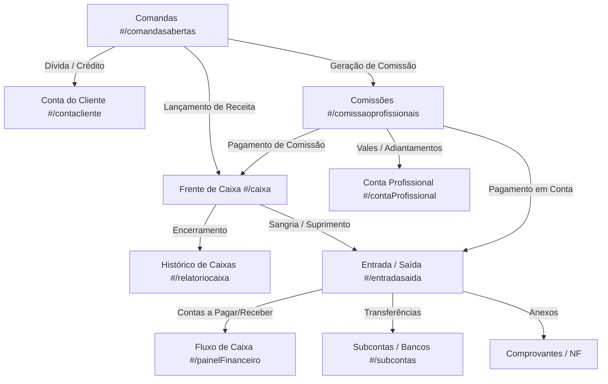
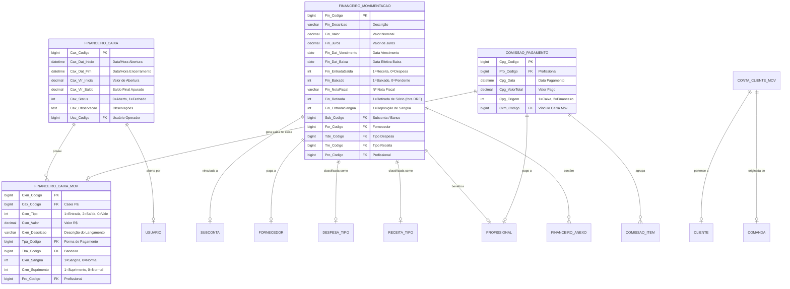

# Mapeamento e Engenharia Reversa Estrutural: Módulo Financeiro (AppBarber)

Este documento apresenta a engenharia reversa completa, mapeamento de protocolos de rede, ciclo de vida da interface, arquitetura de componentes e catálogo exaustivo de endpoints de todas as seções que compõem o **Módulo Financeiro** do sistema **AppBarber**:
1. **Caixa** (`#/caixa`)
2. **Histórico de Caixa** (`#/relatoriocaixa`)
3. **Entrada / Saída (Contas a Pagar, Contas a Receber e Livro Caixa)** (`#/entradasaida`)
4. **Comissões e Extratos de Profissionais** (`#/comissaoprofissionais`)
5. **Conta do Cliente ("Fiado" / Crédito e Débito)** (`#/contacliente`)
6. **Conta do Profissional** (`#/contaProfissional`)
7. **Fluxo de Caixa e DRE** (`#/painelFinanceiro`)
8. **Cadastros Auxiliares (Despesas, Receitas, Contas/Subcontas e Fornecedores)**

---

## 1. Metadados e Arquitetura da Aplicação

- **Framework Front-end:** Single Page Application (SPA) baseada em **AngularJS 1.4.0** com roteamento via **UI-Router** (`$stateProvider`), carregamento dinâmico de scripts e estilos via **ocLazyLoad** e manipulação reativa através de **jQuery 3.x**.
- **Controllers AngularJS Envolvidos:**
  - `caixaCtrl` (`/js/controllers/caixaCtrl.js?749` - 53 KB)
  - `relCaixaCtrl` (`/js/controllers/relCaixaCtrl.js?749` - 23 KB)
  - `movCaixaCtrl` (`/js/controllers/movCaixaCtrl.js?749` - 104 KB)
  - `comissaoProfCtrl` (`/js/controllers/comissaoProfCtrl.js?749` - 278 KB)
  - `contaClienteCtrl` (`/js/controllers/contaClienteCtrl.js?749` - 29 KB)
  - `contaProfissionalCtrl` (`/js/controllers/contaProfissionalCtrl.js?749` - 21 KB)
  - `painelFinanceiroCtrl` (`/js/controllers/painelFinanceiroCtrl.js?749` - 26 KB)
  - `despesasCtrl` (`/js/controllers/despesasCtrl.js?749` - 10 KB)
  - `receitasCtrl` (`/js/controllers/receitasCtrl.js?749` - 12 KB)
  - `subcontasCtrl` (`/js/controllers/subcontasCtrl.js?749` - 6 KB)
- **Componentes de UI & Plugins:**
  - Layout Base: AdminLTE 2.x sobre Bootstrap 3.3.x.
  - **DataTables 1.10.x** com extensões `ColVis`, `Buttons` (`excelHtml5`, `pdfHtml5`, `print`), `Moment-sort` e persistência de estado em `localStorage`.
  - **Select2** para busca assíncrona de clientes, profissionais, fornecedores e categorias de despesa/receita.
  - **Daterangepicker / Datepicker** com presets dinâmicos (*Hoje*, *Ontem*, *Últimos 7 dias*, *Este Mês*, etc.).
  - **Máscaras e Moeda:** `jquery.maskMoney`, `VanillaMasker`, `jquery.inputmask`.
  - **Feedback e Diálogos:** `Toastr`, `SweetAlert` (`swal`) e `jQuery-Impromptu` (`$.prompt`).

---

## 2. Mecanismo de Autenticação e Sessão para Scraping

Todas as requisições aos endpoints PHP operam sob `https://sistema.appbarber.com.br` e necessitam dos seguintes cookies e headers:

```http
User-Agent: Mozilla/5.0 (Windows NT 10.0; Win64; x64) AppleWebKit/537.36 (KHTML, like Gecko) Chrome/120.0.0.0 Safari/537.36
Accept: application/json, text/javascript, */*; q=0.01
X-Requested-With: XMLHttpRequest
Content-Type: application/x-www-form-urlencoded; charset=UTF-8
Cookie: PHPSESSID=<SESSION_ID>; APPBLZ_ID=<ESTABELECIMENTO_HASH_MD5>;
```

---

## 3. Visão Geral da Arquitetura Financeira



---

## 4. Engenharia Reversa por Seção Financeira

---

### 4.1. Módulo de Caixa (`#/caixa`)

O módulo de Caixa gerencia a abertura física do caixa do dia, movimentações de gaveta (entradas avulsas, sangrias, vales, recebimentos de comandas) e fechamento/apuração de saldo.

#### 4.1.1. Modais Mapeados:
1. `#cadastrarCaixa-modal` (Abertura de Caixa):
   - Form: `formCadastroCaixa`
   - Campos: `caxData` (Data `DD/MM/YYYY`), `caxValor` (Valor inicial R$), `caxObservacao` (Texto).
2. `#entradaCaixa-modal` (Entrada Avulsa / Suprimento):
   - Form: `formCaxEntrada`
   - Campos: `caxValorEnt` (Valor), `caxDescEnt` (Descrição), `buscaReceitaCaixa` (Categoria Receita), `pFormaPag` (Forma de Pagamento), `divBandeiraPag` (Bandeira), `suprimentoCaixa` (Select Suprimento).
3. `#saidaCaixa-modal` (Saída / Sangria):
   - Form: `formCaxSaida`
   - Campos: `caxValorSai` (Valor), `caxDescSai` (Descrição), `buscaDespesaCaixa` (Categoria Despesa), `sangria` (Checkbox Sangria), `buscaProfissionalCaixa` (Profissional), `pFormaPagSaida` (Forma Pagamento).
4. `#cadastraVale-modal` (Lançamento de Vale para Colaborador):
   - Campos: `valorValeProfissional` (Valor), `buscaTipoVale` (Categoria Vale), `tipoPagamentoVale` (Forma Pagamento), `profissionalSelVale` (Profissional), `profissionalObsVale` (Obs), `destinoVale` (`1` = Caixa, `2` = Financeiro).
5. `#editaCaixa-modal` & `#editaDataCaixa-modal` (Ajuste de Valor Inicial e Data de Início).
6. `#infoMovimentacaoCaixa-modal` (Detalhamento analítico por forma de pagamento: Dinheiro, Cartão Crédito, Débito, PIX, etc.).
7. `#caixaMovimentacao-modal` (Histórico de movimentações do dia).
8. `#printCaixa-modal` (Relatório de fechamento em A4 ou Térmica 80mm/58mm).

#### 4.1.2. Endpoints do Caixa:

| Ação | Método & Endpoint | Payload Principal | Resposta Sucesso |
| :--- | :--- | :--- | :--- |
| **Abertura de Caixa** | `POST /pages/cadastros/insereFinanceiroCaixa.php` | `caxData`, `caxValor`, `caxObservacao`, `valor` (unmasked) | `{"result":[{"erro":"0","resultado":"Caixa aberto com sucesso"}]}` |
| **Consulta Status Caixa** | `GET /pages/cadastros/buscaFinanceiroCaixa.php` | Parâmetros de sessão | `{"status":"aberto","id":1234,"valorInicial":100.00,"saldo":130.00}` |
| **Lançar Entrada / Saída** | `POST /pages/cadastros/insereFinanceiroCaixaMovimentacaov2.php` | `codigo`, `valor`, `descricao`, `tpacodigo`, `tbacodigo`, `tipo` (1=Entrada, 2=Saída), `trecodigo`, `tdecodigo`, `suprimento`, `sangria` | `{"result":[{"erro":"0","resultado":"Movimentação inserida com sucesso"}]}` |
| **Lançar Vale (Caixa)** | `POST /pages/cadastros/insereFinanceiroCaixaMovimentacao.php` | `valor`, `descricao`, `tipo: 0`, `tdecodigo`, `profissional`, `tpacodigo` | `{"result":[{"erro":"0","resultado":"Vale lançado com sucesso"}]}` |
| **Editar Valor Inicial** | `POST /pages/cadastros/alteraFinanceiroCaixaValor.php` | `caxCodigo`, `caxValor` | `{"result":[{"erro":"0","resultado":"Valor alterado com sucesso"}]}` |
| **Editar Data Início** | `POST /pages/cadastros/alteraFinanceiroCaixaData.php` | `caxCodigo`, `caxData` | `{"result":[{"erro":"0","resultado":"Data alterada com sucesso"}]}` |
| **Excluir Movimentação** | `POST /pages/cadastros/removeFinanceiroCaixaMovimentacao.php` | `codigo` | `{"result":[{"erro":"0","resultado":"Movimentação removida"}]}` |
| **Encerrar Caixa** | `POST /pages/cadastros/atualizaFinanceiroCaixav3.php` | `caxCodigo`, `status: 1` | `{"result":[{"erro":"0","resultado":"Caixa encerrado com sucesso"}]}` |

---

### 4.2. Histórico de Caixa (`#/relatoriocaixa`)

Armazena os caixas fechados e abertos, permitindo estorno/reabertura, conferência de quebras de caixa e emissão de relatórios consolidados.

#### 4.2.1. Endpoints do Histórico de Caixa:

| Ação | Método & Endpoint | Payload Principal | Resposta Sucesso |
| :--- | :--- | :--- | :--- |
| **Listar Histórico** | `POST /pages/relatorios/buscaFinanceiroCaixaRelatorio.php` | `tipo` (0=Todos, 1=Abertos), `dataini` (`DD/MM/YYYY`), `datafim` (`DD/MM/YYYY`) | `{"data":[{"Codigo":"123","Status":"Fechado","Saldo":"R$ 450,00","ValorInicial":"R$ 100,00",...}]}` |
| **Reabrir Caixa** | `POST /pages/cadastros/alteraCaixaReabrir.php` | `codigo` | `{"result":[{"erro":"0","resultado":"Caixa reaberto com sucesso"}]}` |
| **Detalhes do Fechamento** | `POST /pages/relatorios/buscaRelatorioCaixaDetalhes.php` | `codigo` | `{"data":{...resumo por bandeira e forma de pagamento...}}` |

---

### 4.3. Entrada e Saída / Contas a Pagar e Receber (`#/entradasaida`)

O módulo central financeiro ("Livro Caixa Geral" e "Gestão de Títulos"):
- **Aba Entrada/Saída:** Movimentações realizadas e liquidadas.
- **Aba Contas a Pagar:** Despesas provisionadas para datas futuras ou pendentes de liquidação.
- **Aba Contas a Receber:** Receitas provisionadas ou parcelamentos a receber.

#### 4.3.1. Modais Mapeados:
1. `#insereFinanceiro-modal` (Nova Movimentação):
   - **Aba Movimentação Simples (`formInsereFinanceiro`):** `finDescricao`, `finValor`, `finData` (Vencimento), `notafiscal`, `buscaConta` (Subconta), `buscaFornecedor`, `tipoPagamento`, `finEntradaSaida` (1=Entrada, 0=Saída), `buscaDespesa`, `buscaReceita`, `entradaSangria`, `buscaProfissional`, `retiradaFinanceiro` (retirada de sócio que não entra na DRE como despesa), `jurosMovimentacao` (lançado como movimentação separada).
   - **Aba Recorrente / Parcelada (`formInsereFinanceiroRecorrente`):** `tipoMovimentacao` (0=Recorrente, 1=Parcelado), `finPeriodicidade` (1=Diário, 7=Semanal, 15=Quinzenal, 30=Mensal), `finQtdLancamentos` (1 a 24 parcelas), `finDescricaoRecorrente`, `finValorRecorrente`, `finDataRecorrente`, etc.
2. `#AlteraFinanceiro-modal` (`formAlteraFinanceiro`): Edição completa de lançamentos financeiros não liquidados ou já baixados.
3. `#ExecutaBaixa-modal` (`formBaixa`): Baixa individual de contas a pagar/receber com opção de direcionar a movimentação para o **Financeiro** ou transferi-la para a gaveta do **Caixa** do dia.
4. `#BaixaMultipla-modal`: Baixa em lote de múltiplos lançamentos selecionados.
5. `#transferencia-modal` (`formTransferencia`): Transferência interna de valores entre Subcontas (ex: Transferir R$ 500 do *Caixa Gaveta* para a *Conta Banco Inter*), sem impactar DRE.
6. `#novoAnexo-modal`, `#verAnexo-modal` e `#editarAnexo-modal` (`formInsereFinanceiroAnexo`): Upload e gestão de recibos, comprovantes bancários e PDFs fiscais atrelados ao lançamento.

#### 4.3.2. Endpoints de Entrada e Saída:

| Ação | Método & Endpoint | Payload Principal | Resposta Sucesso |
| :--- | :--- | :--- | :--- |
| **Listar Movimentações** | `POST /pages/cadastros/buscaEntradaSaidaCaixa.php` | `dataini`, `datafim`, `conta` (ID Subconta) | `{"data":[{"Codigo":"1","Descricao":"Internet","Valor":"150,00","Tipo":"D","Baixa":"28/08/2026",...}]}` |
| **Inserir Movimentação** | `POST /pages/cadastros/insereFinanceirov4.php` | `finDescricao`, `finValor`, `finData`, `finEntradaSaida`, `finBaixado`, `buscaConta`, `buscaFornecedor`, `buscaDespesa`/`buscaReceita`, `tipoPagamento`, `retiradaFinanceiro`, `entradaSangria` | `{"result":[{"erro":"0","resultado":"Movimentação inserida com sucesso"}]}` |
| **Inserir Recorrente/Parcelado** | `POST /pages/cadastros/insereFinanceiroRecorrentev4.php` | `tipoMovimentacao`, `finPeriodicidade`, `finQtdLancamentos`, `finDescricaoRecorrente`, `finValorRecorrente`, `finDataRecorrente`, ... | `{"result":[{"erro":"0","resultado":"Lançamentos gerados com sucesso"}]}` |
| **Alterar Movimentação** | `POST /pages/cadastros/alteraFinanceirov3.php` | `finCodigoEdt`, `finDescricaoEdt`, `finValorEdt`, `finDataEdt`, `buscaSubContaEdt`, `notafiscalEdt`, ... | `{"result":[{"erro":"0","resultado":"Movimentação alterada com sucesso"}]}` |
| **Baixar Lançamento** | `POST /pages/cadastros/atualizaFinanceiroBaixav4.php` | `finCodigoBaixa`, `destinoFinaceiroBaixa` (0=Financeiro, 1=Caixa), `tipoPagamentoBaixa`, `finDataBaixa`, `buscaSubContaBaixa`, `jurosBaixa` | `{"result":[{"erro":"0","resultado":"Baixa realizada com sucesso"}]}` |
| **Transferência entre Contas** | `POST /pages/cadastros/insereFinanceiroTransferencia.php` | `finValorTransfererncia`, `contaOrigemTransferencia`, `contaDestinoTransferencia` | `{"result":[{"erro":"0","resultado":"Transferência realizada com sucesso"}]}` |
| **Excluir Lançamento** | `POST /pages/cadastros/removeFinanceiro.php` | `codigo` | `{"result":[{"erro":"0","resultado":"Lançamento removido com sucesso"}]}` |
| **Upload de Anexo** | `POST /pages/cadastros/insereFinanceiroAnexo.php` | `file` (multipart), `codigoFinanceiro`, `descricaoAnexo` | `{"result":[{"erro":"0","resultado":"Anexo salvo"}]}` |
| **Excluir Anexo** | `POST /pages/cadastros/removeFinanceiroAnexo.php` | `codigoAnexo` | `{"result":[{"erro":"0","resultado":"Anexo excluído"}]}` |

---

### 4.4. Comissões e Extratos de Profissionais (`#/comissaoprofissionais`)

Responsável pela apuração detalhada de repasses de serviços, produtos, pacotes, assinaturas, descontos de taxas de cartão, vales e deduções.

#### 4.4.1. Regras de Comissionamento Descobertas:
1. **Regime de Dedução de Taxa de Cartão:**
   - **Bruto:** O profissional recebe o percentual sobre o valor total cobrado do cliente, sem desconto de taxas do adquirente/POS.
   - **Líquido (Dividida):** As taxas de cartão (ex: 2.5% débito, 3.9% crédito) são divididas proporcionalmente entre o salão e o profissional.
   - **Descontado (Integral):** O custo total da taxa do cartão é debitado exclusivamente da comissão do colaborador.
2. **Comissão sobre Pacotes e Clubes de Assinatura:**
   - Possui suporte a comissão na venda do pacote ou comissão na execução de cada sessão consumida.
   - Suporte a modelo de "Pote de Assinatura" (`insereComissaoAssinaturaPote.php`).
3. **Pagamento e Quitação de Comissões:**
   - O pagamento pode ser feito de forma integral ou particionada (`atualizaComissaoPagamentoParticionadov3.php`).
   - O saldo pago pode gerar saída automática no Caixa (`insereCaixa=1`) ou no Livro Caixa Financeiro.

#### 4.4.2. Endpoints de Comissões:

| Ação | Método & Endpoint | Payload Principal | Resposta Sucesso |
| :--- | :--- | :--- | :--- |
| **Relatório Sintético/Analítico** | `POST /pages/relatorios/buscaRelatorioComissaov2.php` | `dataini`, `datafim`, `tipo` (Sintético/Analítico), `status` (0=Não Pagas, 1=Pagas, 2=Todas), `profissionais` (Array IDs) | `{"data":[{...comissões por profissional, totais de serviços, produtos, vales...}]}` |
| **Recalcular Comissões** | `POST /pages/cadastros/atualizaCalculoComissaov2.php` | `dataini`, `datafim`, `profissionais` | `{"result":[{"erro":"0","resultado":"Comissões recalculadas com sucesso"}]}` |
| **Pagar Comissão** | `POST /pages/cadastros/atualizaComissaoPagamentov6.php` | `profissional`, `valorTotal`, `comissoesIds` (Array), `insereCaixa`, `contaFinanceiro`, `tipoPagamento` | `{"result":[{"erro":"0","resultado":"Comissão paga com sucesso"}]}` |
| **Estornar Pagamento** | `POST /pages/cadastros/removePagamentoComissaov3.php` | `codigoPagamento` | `{"result":[{"erro":"0","resultado":"Pagamento estornado com sucesso"}]}` |
| **Lançar Gorjeta / Caixinha** | `POST /pages/cadastros/inserePessoaCaixinha.php` | `profissional`, `valor`, `data`, `obs` | `{"result":[{"erro":"0","resultado":"Gorjeta lançada"}]}` |
| **Lançar Ajuste Manual** | `POST /pages/cadastros/insereComissaoProfissional.php` | `profissional`, `valor`, `tipo` (Bonificação/Desconto), `descricao`, `data` | `{"result":[{"erro":"0","resultado":"Comissão ajustada"}]}` |
| **Emitir NFS-e de Repasse** | `POST /pages/cadastros/insereNotaFiscalComissao.php` | `codigoPagamento`, `dadosFiscais` | `{"result":[{"erro":"0","resultado":"NFS-e emitida"}]}` |

---

### 4.5. Conta do Cliente ("Fiado") (`#/contacliente`)

Controla a conta corrente de crédito e débito de cada cliente (o famoso "Fiado"). Não gera lançamento financeiro imediato até que o cliente realize o pagamento da dívida ou utilize seus créditos.

#### 4.5.1. Endpoints de Conta do Cliente:

| Ação | Método & Endpoint | Payload Principal | Resposta Sucesso |
| :--- | :--- | :--- | :--- |
| **Listar Saldos dos Clientes** | `POST /pages/cadastros/buscaContaClientes.php` | `tipo: 1` (Clientes) | `{"data":[{"Codigo":"10","Nome":"João Silva","Saldo":"-50,00","Status":"Debito",...}]}` |
| **Lançar Crédito (Entrada)** | `POST /pages/cadastros/insereContaCliente_v6.php` | `cliente`, `valor`, `tipo: 1` (Crédito), `descricao`, `insereCaixa`, `tipoPagamento` | `{"result":[{"erro":"0","resultado":"Crédito lançado com sucesso"}]}` |
| **Lançar Débito (Dívida)** | `POST /pages/cadastros/insereContaCliente_v6.php` | `cliente`, `valor`, `tipo: 2` (Débito), `descricao` | `{"result":[{"erro":"0","resultado":"Débito lançado com sucesso"}]}` |
| **Extrato do Cliente** | `POST /pages/cadastros/buscaPessoaContav2.php` | `codigoCliente` | `{"data":[{...histórico de lançamentos, comandas e pagamentos...}]}` |
| **Quitar Dívida via Caixa** | `POST /pages/cadastros/insereContaCliente_v5.php` | `cliente`, `valorPago`, `tipoPagamento`, `insereCaixa: 1` | `{"result":[{"erro":"0","resultado":"Dívida quitada e lançada no caixa"}]}` |

---

### 4.6. Conta do Profissional (`#/contaProfissional`)

Controle de saldo em conta corrente dos colaboradores para despesas avulsas, cursos ou empréstimos internos (separado da comissão automática de atendimentos).

#### 4.6.1. Endpoints:
- **Listar Saldos:** `POST /pages/cadastros/buscaContaClientes.php` (com parâmetro de colaboradores).
- **Extrato do Colaborador:** `POST /pages/cadastros/buscaPessoaContav2.php?codigo={ID_PROFISSIONAL}`.
- **Lançar Crédito / Débito:** `POST /pages/cadastros/insereContaCliente_v2.php`.

---

### 4.7. Fluxo de Caixa e DRE (`#/painelFinanceiro`)

Dashboard analítico de faturamento, liquidez e projeção financeira.

#### 4.7.1. Abas e Componentes:
1. **Fluxo de Caixa:** Cards de *Total Movimentado*, *Total Disponível* (líquido na mão) e *Total a Receber* (cartões a compensar). Resumo por forma de pagamento (Dinheiro, PIX, Cartões) e por item (Serviços, Produtos, Pacotes, Assinaturas).
2. **Fluxo Geral:** Gráficos diários e mensais comparativos de receitas versus despesas.
3. **Painel Financeiro (DRE):** Demonstrativo de Resultados do Exercício com Lucro Líquido, Margem Operacional e custos categorizados.

#### 4.7.2. Endpoints:
- `POST /pages/relatorios/buscaPainelFinanceirov2.php` (Payload: `dataini`, `datafim`).
- `POST /pages/relatorios/buscaRelGerencialFluxoCaixa.php` (Payload: `dataini`, `datafim`, `tipo`).

---

### 4.8. Cadastros Auxiliares Financeiros

Gerenciamento das entidades que sustentam a classificação contábil e movimentações do sistema:

#### 4.8.1. Despesas (`#/despesas` - `despesasCtrl`):
- `POST /pages/cadastros/buscaDespesa_v2.php` (Listagem)
- `POST /pages/cadastros/insereDespesav3.php` (Criar despesa: `desNome`, `desCategoria`, `desTipo`)
- `POST /pages/cadastros/alteraDespesav3.php` (Editar)
- `POST /pages/cadastros/removeDespesa.php` (Excluir)
- Categorias de Despesa: `insereDespesaCategoria.php`, `alteraDespesaCategoria.php`, `removeDespesaCategoria.php`.

#### 4.8.2. Receitas (`#/receitas` - `receitasCtrl`):
- `POST /pages/cadastros/buscaReceita.php` (Listagem)
- `POST /pages/cadastros/RECEITA_Insere.php` / `insereReceitav2.php` (Criar receita: `recNome`, `recCategoria`)
- `POST /pages/cadastros/RECEITA_Altera.php` / `alteraReceitav2.php` (Editar)
- `POST /pages/cadastros/removeReceita.php` (Excluir)
- Categorias de Receita: `insereReceitaCategoria.php`, `alteraReceitaCategoria.php`, `removeReceitaCategoria.php`.

#### 4.8.3. Subcontas / Contas Bancárias (`#/subcontas` - `subcontasCtrl`):
- `POST /pages/cadastros/buscaSubConta.php` (Listagem de contas: *Gaveta*, *Banco do Brasil*, *Itaú*, *Nubank*, etc.)
- `POST /pages/cadastros/insereSubContav2.php` (Criar: `subNome`, `subSaldoInicial`, `subTipo`)
- `POST /pages/cadastros/alteraSubContav2.php` (Editar)
- `POST /pages/cadastros/removeSubConta.php` (Excluir)

---

## 5. Mapeamento de Modelos de Dados (Diagrama ER)



---

## 6. Casos de Borda e Validações Críticas Testadas em Tempo Real

1. **Abertura e Bloqueio de Caixa:**
   - O sistema bloqueia a abertura de um novo caixa caso já exista um caixa com status `Aberto` para o mesmo usuário/terminal.
   - O valor inicial do caixa (`caxValor`) possui teto de validação no front-end (`max="25000"`).

2. **Sangria vs. Reposição de Sangria:**
   - Uma sangria lançada no Caixa (`tipo=2`, `sangria=1`) reduz o saldo físico da gaveta.
   - Para reentrar esse valor no Financeiro Geral sem distorcer o faturamento bruto como "nova receita", o sistema utiliza a flag `entradaSangria=1`, impedindo a duplicidade contábil.

3. **Retirada de Sócios (Pró-Labore / Distribuição):**
   - Ao lançar uma despesa com `retiradaFinanceiro=1`, o valor é subtraído do saldo real da conta bancária, mas é expurgado dos relatórios de DRE e margem de contribuição operacional.

4. **Baixa com Transferência para Caixa:**
   - Na tela de Contas a Pagar/Receber, dar baixa com `destinoFinaceiroBaixa=1` (Caixa) remove o lançamento do financeiro e insere uma linha no caixa aberto do dia, desvinculando campos exclusivos de banco (como fornecedor e anexo).

5. **Transferência Entre Contas:**
   - Cria duas pontas de lançamento instantâneas (saída na conta origem e entrada na conta destino), preservando o saldo consolidado do estabelecimento e impedindo lançamentos de despesa fictícia.
