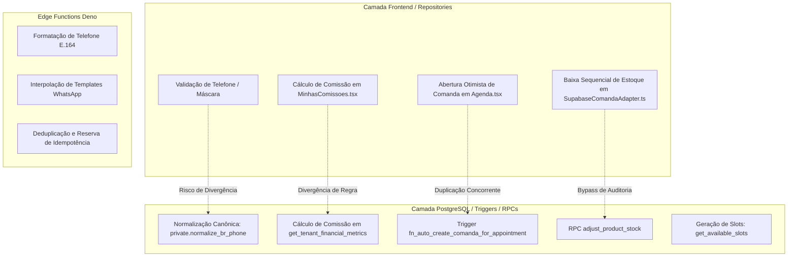

# Relatório de Auditoria Integral do Sistema: Regras de Negócio, Banco de Dados, RLS e Impactos Cruzados

**Projeto:** Navalhado (SaaS de Gestão e Agendamento para Barbearias)  
**Data da Auditoria:** 27/08/2026  
**Escopo:** Diagnóstico de Consistência e Integridade Arquitetural (Sem modificações imediatas de código/banco)  
**Tecnologias Auditadas:** PostgreSQL 15 (Supabase), 65 Migrations SQL, Row Level Security (RLS), Triggers, RPCs com `SECURITY DEFINER`, Deno Edge Functions, React / TypeScript / Vite, Adapters e Repositories.

---

## 1. RESUMO EXECUTIVO

Esta auditoria realizou uma análise diagnóstica completa e estrutural de todos os fluxos de negócio, tabelas de banco de dados, migrações, funções em PL/pgSQL, políticas de segurança em nível de linha (RLS), controle de acesso baseado em papéis (RBAC), disparo de notificações via WhatsApp e integridade de dados históricos no sistema **Navalhado**.

### Principais Conclusões:
1. **Segurança Multi-Tenant:** O isolamento horizontal entre barbearias (**Tenant Isolation**) é consistente em 100% das tabelas e rotas públicas. O acesso público é rigidamente restrito via RPCs com chaves bearer de acesso tokenizado (`token_acesso`), impedindo que o *Tenant A* visualize ou interaja com registros do *Tenant B*.
2. **Ciclo de Vida do Cliente e Assimetria de Exclusão (P1):** A exclusão de clientes no painel realiza `DELETE` físico direto. Quando o cliente possui agendamentos, o banco bloqueia a exclusão por trava de integridade referencial (`ON DELETE RESTRICT`). Quando não possui agendamentos, o registro é destruído fisicamente, provocando **reenvio indevido de mensagem de boas-vindas** em caso de novo cadastro posterior e órfãos relacionais em comandas de balcão (`customer_id` vira `NULL`).
3. **Deriva Contábil e Histórica (P1):** A tabela `comanda_itens` não congela (snapshot) o percentual de comissão nem o custo unitário do produto vigentes no momento da liquidação. As consultas financeiras calculam repasses em tempo de execução via `JOIN`. Portanto, **alterar a comissão de um profissional ou o custo de um produto hoje altera retroativamente todos os relatórios contábeis de meses passados**.
4. **Brechas de Autorização Interna no Papel Barbeiro (P1):** Embora o RLS bloqueie ações externas, as políticas de segurança de `professional_services`, `cash_movements`, `product_movements` e `commission_payouts` foram configuradas permitindo qualquer usuário autenticado do tenant. Isso permite que um profissional com papel `barbeiro` consulte quitações de colegas, insira pagamentos de comissão e movimente o caixa diretamente pela REST API.
5. **Divergência de Regras entre Frontend e Banco (P1):** A tela `MinhasComissoes.tsx` ignora a comissão customizada de `professional_services`, enquanto a RPC `get_tenant_financial_metrics` a prioriza. Além disso, a baixa de estoque na liquidação de comandas é feita via loop no frontend sem auditoria em `product_movements`, ignorando a RPC transacional nativa `adjust_product_stock`.

---

## 2. MAPA DAS PRINCIPAIS ENTIDADES DO SISTEMA

O sistema opera com 25 entidades mapeadas no banco de dados. A tabela abaixo resume as propriedades canônicas das entidades centrais:

| Entidade | Chave Primária | `tenant_id` | Chaves Estrangeiras & Cascata | Status / Flags de Ativação | Exclusão / Soft Delete | Regras de Unicidade | Processos Principais que Leem | Processos Principais que Alteram |
|---|---|---|---|---|---|---|---|---|
| `tenants` | `id` (UUID) | Próprio ID | Nenhuma | `onboarding_completed` (boolean) | Física (SaaS Admin) | `UNIQUE(email)`, `UNIQUE(slug)` | Auth, Wizard, Agenda, Agendamento Público, Edge Functions | Cadastro, Wizard Onboarding, Configurações |
| `users` | `id` (UUID -> `auth.users`) | `tenant_id` (NULL para SaaS Admin) | `tenant_id` -> `tenants(id)` ON DELETE SET NULL | `is_active` (boolean) | Física (Gerente/Admin) | `UNIQUE(email)` | Auth Guard, Sessões, RLS Helper Functions | Cadastro, Gestão de Acessos |
| `professionals` | `id` (UUID) | `tenant_id` NOT NULL | `user_id` -> `users(id)` ON DELETE SET NULL | `is_active` (boolean) | **Soft Delete:** `deleted_at` (TIMESTAMPTZ) | Nenhuma | Grade da Agenda, Slots Públicos, Relatórios, Comissões | Wizard, Profissionais, Onboarding |
| `services` | `id` (UUID) | `tenant_id` NOT NULL | `tenant_id` -> `tenants(id)` ON DELETE CASCADE | `is_active` (boolean) | **Soft Delete:** `deleted_at` (TIMESTAMPTZ) | Nenhuma | Catálogo Público, Agenda, Checkout de Comandas, Lembretes | Wizard, Serviços, Comandas |
| `professional_services` | `id` (UUID) | `tenant_id` NOT NULL | `professional_id` ON DELETE CASCADE, `service_id` ON DELETE CASCADE | `is_enabled` (boolean) | **Física** (DELETE direto) | `UNIQUE(tenant_id, professional_id, service_id)` | Cálculo de Slots, Comissões Dinâmicas, Central 360 | Gestão de Profissionais, Serviços |
| `customers` | `id` (UUID) | `tenant_id` NOT NULL | `tenant_id` -> `tenants(id)` ON DELETE CASCADE | `cadastro_completo` (boolean) | **Física** (DELETE direto) | `UNIQUE(tenant_id, telefone_normalizado)` | Central 360, Clientes, Agenda, Canal Cliente, WhatsApp | Salvar Cliente, Agendamento Público, Token RPCs |
| `appointments` | `id` (UUID) | `tenant_id` NOT NULL | `customer_id` (RESTRICT), `professional_id` (RESTRICT), `service_id` (RESTRICT) | `status`, `payment_status`, `is_fitting` | Cancelamento Lógico (`status = 'canceled'`) | Nenhuma (Validação temporal via RPC) | Agenda, Minha Agenda, Grade Temporal, Triggers WhatsApp | Modal Agendamento, Canal Cliente RPC, Cancelamento |
| `comandas` | `id` (UUID) | `tenant_id` NOT NULL | `appointment_id` (SET NULL), `customer_id` (SET NULL) | `status` (`'aberta'\|'fechada'\|'cancelada'`) | Cancelamento Lógico (`status = 'cancelada'`) | `UNIQUE(appointment_id)` (quando não nulo) | Painel Comandas, Checkout, Histórico 360, Financeiro | Trigger Agendamento, Adapter Comandas, Checkout Modal |
| `comanda_itens` | `id` (UUID) | `tenant_id` NOT NULL | `comanda_id` ON DELETE CASCADE, `service_id` (SET NULL), `product_id` (SET NULL), `professional_id` (SET NULL) | N/A | Física (Remoção de item) | Nenhuma | Painel Comandas, Relatórios Financeiros, Minhas Comissões | Comanda Adapter, Adicionar Item, Checkout |
| `comanda_pagamentos` | `id` (UUID) | `tenant_id` NOT NULL | `comanda_id` ON DELETE CASCADE, `cash_session_id` (SET NULL) | N/A | Física (ao reabrir comanda) | Nenhuma | Checkout Comanda, Fechamento de Caixa, Auditoria | Checkout Modal, Adapter Comandas |
| `cash_sessions` | `id` (UUID) | `tenant_id` NOT NULL | `opened_by` (SET NULL), `closed_by` (SET NULL) | `status` (`'aberta'\|'fechada'`) | Nenhuma | Nenhuma | Hub Financeiro, Abertura/Fechamento Caixa | Abertura Caixa, Fechamento Caixa Modal |
| `cash_movements` | `id` (UUID) | `tenant_id` NOT NULL | `cash_session_id` ON DELETE CASCADE | `type` (`'sangria'\|'suprimento'`) | Nenhuma | Nenhuma | Hub Financeiro (Caixa Diário) | Modal Sangria / Suprimento |
| `commission_payouts` | `id` (UUID) | `tenant_id` NOT NULL | `professional_id` ON DELETE CASCADE, `created_by` (SET NULL) | N/A | Nenhuma | Nenhuma | Hub Financeiro (Repasses), Minhas Comissões | RPC `register_commission_payout` |
| `products` | `id` (UUID) | `tenant_id` NOT NULL | `tenant_id` -> `tenants(id)` ON DELETE CASCADE | `is_active` (boolean) | Física (DELETE direto) | Nenhuma | Estoque, Comandas, Relatórios Financeiros | Cadastro de Produtos, Adapter Comandas |
| `product_movements` | `id` (UUID) | `tenant_id` NOT NULL | `product_id` ON DELETE CASCADE, `comanda_id` (SET NULL) | `movement_type` | Nenhuma (Imutável) | Nenhuma | Relatório de Auditoria de Estoque, CMV | RPC `adjust_product_stock` |
| `blocked_slots` | `id` (UUID) | `tenant_id` NOT NULL | `professional_id` ON DELETE CASCADE | N/A | Física (DELETE direto) | Nenhuma | Grade da Agenda, Cálculo de Slots Livres RPC | Bloqueio Modal, Exclusão de Bloqueio |
| `waiting_list` | `id` (UUID) | `tenant_id` NOT NULL | `customer_id` (SET NULL), `professional_id` (SET NULL), `service_id` (SET NULL) | `status` (`'waiting'\|'called'\|'attended'\|'canceled'`) | Física (DELETE direto) | Nenhuma | Drawer Lista de Espera, Encaixe Rápido | Lista Espera Drawer, Agenda |
| `whatsapp_instances` | `id` (UUID) | `tenant_id` NOT NULL | `tenant_id` ON DELETE CASCADE | `status` (`'connected'\|'connecting'\|'disconnected'\|'hibernated'`) | Nenhuma | `UNIQUE(tenant_id)`, `UNIQUE(instance_name)` | Painel WhatsApp, Triggers Postgres, Edge Functions | Gestão WhatsApp, Webhooks Uazapi |
| `whatsapp_message_idempotency`| `id` (UUID) | `tenant_id` NOT NULL | `whatsapp_instance_id` (SET NULL), `appointment_id` (SET NULL) | `status` (`'processing'\|'succeeded'\|'failed'`) | Nenhuma | `UNIQUE(tenant_id, direction, idempotency_key)` | Edge Function `whatsapp-integration` | Edge Function Outbound/Inbound |
| `notifications` | `id` (UUID) | `tenant_id` NOT NULL | `professional_id` ON DELETE CASCADE | `read` (boolean) | Física (Marcar como lida / limpar) | Nenhuma | NotificationBell, Realtime Subscriptions | Trigger `handle_appointment_notification` |
| `audit_logs` | `id` (UUID) | `tenant_id` | `user_id` (SET NULL) | N/A | Imutável (DELETE/UPDATE bloqueados) | Nenhuma | Logs de Auditoria LGPD | RPC `log_audit_event` |

---

## 3. IDENTIFICAÇÃO DA FONTE DE VERDADE E RISCOS DE DUPLICIDADE



### Análise Detalhada de Fontes de Verdade:

1. **Geração e Validação de Slots de Horário:**
   - **Fonte de Verdade:** Banco de Dados (`public.get_available_slots` / `public.get_available_slots_by_token`).
   - **Status:** ✅ Consistente. Avalia simultaneamente `business_hours` do tenant, `weekly_schedule` e intervalos de almoço dos barbeiros, agendamentos confirmados em `appointments` e bloqueios em `blocked_slots`.
2. **Abertura de Comanda no Agendamento:**
   - **Implementação Duplicada:** Existe trigger no banco (`fn_auto_create_comanda_for_appointment` na migration 049) E lógica no frontend (`Agenda.tsx`).
   - **Risco:** ⚠️ Risco Médio. Embora ambos verifiquem `IF NOT EXISTS`, a duplicação cria dependência frágil e executa chamadas redundantes à API REST.
3. **Cálculo de Comissões:**
   - **Implementação Duplicada & Inconsistente:** 
     - No backend (`get_tenant_financial_metrics`), a comissão obedece à hierarquia: `COALESCE(professional_services.custom_commission_percentage, services.commission_percentage, professionals.commission_percentage)`.
     - No frontend do barbeiro (`MinhasComissoes.tsx`), a comissão é calculada ignorando `professional_services`: `item.service?.commission_percentage ?? professional.commission_percentage`.
   - **Status:** ❌ Inconsistente (P1). Se houver comissão personalizada por serviço/profissional, o Gerente e o Barbeiro visualizam valores diferentes.
4. **Baixa de Estoque de Produtos:**
   - **Fonte de Verdade Teórica:** RPC `adjust_product_stock` (com gravação em `product_movements`).
   - **Implementação Real:** O frontend (`SupabaseComandaAdapter.ts`) executa `supabase.from('products').update(...)` diretamente no cliente sem chamar a RPC e sem registrar na tabela de movimentos.
   - **Status:** ❌ Inconsistente (P1). Quebra a rastreabilidade e auditoria de estoque.

---

## 4. AUDITORIA DE EXCLUSÃO, INATIVAÇÃO E SOFT DELETE

```
┌────────────────────────────────────────────────────────────────────────┐
│                        MAPA DE CICLOS DE REMOÇÃO                       │
├───────────────────┬───────────────────┬────────────────────────────────┤
│   SOFT DELETE     │    INATIVAÇÃO     │         HARD DELETE            │
│   (deleted_at)    │    (is_active)    │      (DELETE FROM table)       │
├───────────────────┼───────────────────┼────────────────────────────────┤
│ • services        │ • professionals   │ • customers                    │
│ • professionals   │ • services        │ • products                     │
│                   │ • users           │ • blocked_slots                │
│                   │ • tenants         │ • waiting_list                 │
│                   │                   │ • professional_services        │
│                   │                   │ • comanda_itens                │
│                   │                   │ • comanda_pagamentos           │
└───────────────────┴───────────────────┴────────────────────────────────┘
```

### Comportamento Detalhado por Entidade:

1. **`services` e `professionals` (Soft Delete + Inativação):**
   - Implementado na Migration `050`.
   - Ao excluir no painel, define `deleted_at = now()` e `is_active = false`.
   - A função `get_available_slots` filtra `deleted_at IS NULL`.
   - Histórico em `appointments`, `comanda_itens` e `financial_metrics` permanece íntegro e legível.
2. **`customers` (Exclusão Física / Hard Delete com Bloqueio por FK):**
   - A interface chama `SupabaseClienteAdapter.excluirCliente`, que executa `DELETE FROM customers WHERE id = clienteId`.
   - **Se o cliente possuir agendamentos (`appointments`):** O banco bloqueia a exclusão com erro Postgres `23503` (Foreign Key `appointments_customer_id_fkey` possui regra `ON DELETE RESTRICT`). O usuário recebe um erro genérico na interface.
   - **Se o cliente NÃO possuir agendamentos:** O cliente é apagado fisicamente. Em `comandas` e `waiting_list`, a coluna `customer_id` é setada para `NULL` (`ON DELETE SET NULL`), perdendo a autoria do histórico de compras de balcão.
3. **`professional_services` (Hard Delete):**
   - Ao desassociar um serviço de um barbeiro, o registro é deletado fisicamente da tabela. Como a tabela não possui `deleted_at`, consultas financeiras retroativas perdem a referência da comissão personalizada combinada naquele período.
4. **`products` (Hard Delete):**
   - Não possui `deleted_at`. Se um produto for excluído pelo gerente, todas as comandas antigas que continham aquele item continuam com `product_id = NULL`, mas perdem o nome do produto no histórico detalhado caso a comanda não tenha snapshot.

---

## 5. CENÁRIO OBRIGATÓRIO: CLIENTE EXCLUÍDO E NOVO CADASTRO

Investigação aprofundada do ciclo de vida:  
**Cadastrar -> Enviar Boas-Vindas -> Excluir -> Recadastrar com mesmo Telefone -> Analisar Boas-Vindas**.

### Matriz de Diagnóstico do Cenário

| Etapa | Estado / Propriedade | Comportamento Real no Sistema Hoje | Regra / Código Responsável |
|---|---|---|---|
| **1. Cadastro Inicial** | Origem: Balcão | Cria registro em `public.customers` com `registration_origin = 'balcao'`, `cadastro_completo = true`, `welcome_sent_at = NULL` e UUID novo. | `SupabaseClienteAdapter.ts:60-68` |
| **2. Boas-Vindas** | Disparo da Mensagem | Trigger `trg_customer_welcome_balcao` dispara via `pg_net` para a Edge Function. Idempotência reservada com chave `customer:<ID_A>:customer_welcome_balcao`. Edge Function envia WhatsApp e grava `welcome_sent_at = now()`. | Migration 051:52-94 / `whatsapp-integration/index.ts:1452` |
| **3. Tentativa de Exclusão** | Se cliente TEM agendamentos | **FALHA:** O banco rejeita a exclusão física (`ON DELETE RESTRICT` em `appointments_customer_id_fkey`). O registro permanece ativo e o telefone permanece no banco. | Migration 20260712:99 |
| **3b. Exclusão Concluída** | Se cliente NÃO TEM agendamentos | **REMOVIDO FISICAMENTE:** A linha em `customers` é deletada. O telefone deixa de existir na tabela. A chave de idempotência antiga (`customer:<ID_A>:...`) fica órfã em `whatsapp_message_idempotency`. | `SupabaseClienteAdapter.ts:77` |
| **4. Novo Cadastro** | Recriar com mesmo telefone (`92999999999`) | **CRIA NOVO REGISTRO (ID_B):** Como o registro anterior foi fisicamente apagado, o índice `customers_tenant_telefone_normalizado_uidx` não encontra conflito. Gera novo `id` (UUID_B), novo `token_acesso` e `welcome_sent_at = NULL`. | Migration 20260715120000:104 |
| **5. Disparo de Boas-Vindas** | Análise de Reenvio | **DISPARA NOVAMENTE (SIM):** A trigger `trg_customer_welcome_balcao` dispara para o novo `id` (UUID_B). A chave de idempotência gerada é `customer:<ID_B>:customer_welcome_balcao`. Como a chave usa o `id` da linha (e não o telefone normalizado), a Edge Function **não reconhece como duplicado e envia uma nova mensagem de boas-vindas**. | `whatsapp-integration/index.ts:1452` |

### Resumo Técnico do Cenário:
- **Exclusão é física ou soft delete?** É exclusão física (Hard Delete).
- **Telefone continua armazenado após exclusão bem-sucedida?** Não.
- **Recriação reativa registro antigo ou cria outro?** Cria um registro totalmente novo (novo UUID e novo token).
- **Gera duplicidade?** Não gera duplicidade no banco porque o anterior foi apagado, mas gera **duplicidade de envio de mensagem de boas-vindas** ao destinatário físico.
- **Por que a mensagem é disparada de novo?** Porque a chave de idempotência foi desenhada como `customer:${customerId}:customer_welcome_balcao`, ancorando-se no ID da linha do banco em vez da tupla imutável do mundo real `(tenant_id, telefone_normalizado)`.

---

## 6. AUDITORIA DE REGRAS DE UNICIDADE E NORMALIZAÇÃO DE DADOS

### Normalização de Telefones

Auditoria do fluxo de normalização:
1. **Entrada UI:** Aceita `(92) 98520-9999`, `+5592985209999`, `92985209999` ou `92 98520-9999`.
2. **Normalização no Banco:** Função `private.normalize_br_phone(phone)` (Migration 20260715120000):
   - Remove caracteres não numéricos (`regexp_replace(p_phone, '[^0-9]', '', 'g')`).
   - Se possuir 10 ou 11 dígitos (DDD + número), prefixa com `'55'`.
   - Se já possuir `55` e totalizar 12 ou 13 dígitos, preserva.
   - Caso contrário, retorna `NULL`.
3. **Coluna Gerada:** `telefone_normalizado text generated always as (private.normalize_br_phone(phone)) stored`.
4. **Conclusão:** Todos os 4 formatos de teste (`92985209999`, `+5592985209999`, `(92) 98520-9999`, `92 98520-9999`) convergem exatamente para o mesmo valor canônico: `5592985209999`. É **impossível** que representem clientes duplicados dentro do mesmo tenant.

---

## 7. AUDITORIA DE ROW LEVEL SECURITY (RLS)

Todas as 25 tabelas públicas possuem `ROW LEVEL SECURITY` ativado. Analisamos detalhadamente as políticas de cada tabela contra vazamento entre tenants e privilégios indevidos entre papéis:

| Tabela | RLS Habilitado | Policies Existentes | Papéis Permitidos | Condição `USING` / `WITH CHECK` | Risco de Vazamento / Vulnerabilidade |
|---|---|---|---|---|---|
| `plans` | ✅ SIM | `SELECT`, `INSERT`, `UPDATE`, `DELETE` | `SELECT`: anon, auth<br>`WRITE`: admin | `SELECT: true`<br>`WRITE: private.is_saas_admin()` | Nenhum. Catálogo público. |
| `tenants` | ✅ SIM | `SELECT`, `INSERT`, `UPDATE`, `DELETE` | `SELECT/UPDATE`: gerente, admin<br>`INSERT`: anon | `SELECT: id = get_auth_tenant_id()`<br>`UPDATE: role = 'gerente'` | Nenhum. |
| `users` | ✅ SIM | `SELECT`, `INSERT`, `UPDATE`, `DELETE` | `SELECT`: tenant users<br>`WRITE`: gerente, admin, self | `SELECT: tenant_id = get_auth_tenant_id()`<br>`UPDATE: role = 'gerente' OR id = auth.uid()` | Protegido por trigger contra auto-promoção de role. |
| `professionals` | ✅ SIM | `SELECT`, `INSERT`, `UPDATE`, `DELETE` | `SELECT`: tenant users<br>`WRITE`: gerente, admin | `SELECT: tenant_id = get_auth_tenant_id()`<br>`WRITE: role = 'gerente'` | Nenhum. |
| `services` | ✅ SIM | `SELECT`, `INSERT`, `UPDATE`, `DELETE` | `SELECT`: tenant users<br>`WRITE`: gerente, admin | `SELECT: tenant_id = get_auth_tenant_id()`<br>`WRITE: role = 'gerente'` | Nenhum. |
| `professional_services` | ✅ SIM | `SELECT`, `INSERT`, `UPDATE`, `DELETE` | **`authenticated` (qualquer role do tenant)** | `tenant_id IN (SELECT tenant_id FROM users WHERE id = auth.uid())` | ❌ **P1:** Barbeiro pode alterar percentual de comissão de outros profissionais via REST. |
| `customers` | ✅ SIM | `SELECT`, `INSERT`, `UPDATE`, `DELETE` | `SELECT/INSERT/UPDATE`: auth tenant<br>`DELETE`: gerente | `SELECT: tenant_id = get_auth_tenant_id()`<br>`DELETE: role = 'gerente'` | Nenhum vazamento entre tenants. Barbeiro pode editar dados de clientes. |
| `appointments` | ✅ SIM | `SELECT`, `INSERT`, `UPDATE`, `DELETE` | `SELECT`: gerente, barbeiro próprio<br>`WRITE`: gerente, barbeiro próprio | `SELECT: role = 'gerente' OR is_own_appointment(id)`<br>`DELETE: role = 'gerente'` | Seguro. Barbeiro não enxerga agendamentos de outros barbeiros. |
| `comandas` | ✅ SIM | `SELECT`, `INSERT`, `UPDATE`, `DELETE` | `SELECT/INSERT/UPDATE`: gerente, barbeiro<br>`DELETE`: gerente | `SELECT: tenant_id = get_auth_tenant_id()`<br>`DELETE: role = 'gerente'` | Barbeiro pode alterar status de comandas de outros barbeiros. |
| `comanda_itens` | ✅ SIM | `SELECT`, `INSERT`, `UPDATE`, `DELETE` | `SELECT/INSERT/UPDATE`: gerente, barbeiro<br>`DELETE`: gerente | `tenant_id = get_auth_tenant_id()` | Barbeiro pode adicionar itens em qualquer comanda aberta. |
| `comanda_pagamentos`| ✅ SIM | `SELECT`, `INSERT`, `UPDATE`, `DELETE` | `SELECT/INSERT`: gerente, barbeiro<br>`UPDATE/DELETE`: gerente | `tenant_id = get_auth_tenant_id()` | Barbeiro pode registrar pagamentos de comanda. |
| `cash_sessions` | ✅ SIM | `SELECT`, `INSERT`, `UPDATE`, `DELETE` | `SELECT`: auth tenant<br>`WRITE`: gerente | `SELECT: tenant_id = get_auth_tenant_id()`<br>`WRITE: role = 'gerente'` | Seguro. |
| `cash_movements` | ✅ SIM | `SELECT`, `INSERT`, `UPDATE`, `DELETE` | **`authenticated` (qualquer role do tenant)** | `tenant_id IN (SELECT tenant_id FROM users WHERE id = auth.uid())` | ❌ **P1:** Barbeiro pode criar sangrias e suprimentos no caixa e até deletá-los via REST. |
| `commission_payouts`| ✅ SIM | `SELECT`, `INSERT` | **`authenticated` (qualquer role do tenant)** | `tenant_id = get_auth_tenant_id()` | ❌ **P1:** Barbeiro pode visualizar quanto outros barbeiros receberam e forçar inserção de quitação. |
| `products` | ✅ SIM | `SELECT`, `INSERT`, `UPDATE`, `DELETE` | `SELECT`: auth tenant<br>`UPDATE`: gerente, barbeiro<br>`INSERT/DELETE`: gerente | `tenant_id = get_auth_tenant_id()` | ⚠️ **P2:** Barbeiro pode alterar preço e estoque de produtos diretamente. |
| `product_movements` | ✅ SIM | `SELECT`, `INSERT`, `UPDATE`, `DELETE` | **`authenticated` (qualquer role do tenant)** | `tenant_id IN (SELECT tenant_id FROM users WHERE id = auth.uid())` | ❌ **P1:** Barbeiro pode apagar/alterar histórico de movimentação de estoque. |
| `blocked_slots` | ✅ SIM | `SELECT`, `INSERT`, `UPDATE`, `DELETE` | `SELECT`: auth tenant<br>`WRITE`: gerente, barbeiro próprio | `role = 'gerente' OR is_own_professional(professional_id)` | Seguro. |
| `waiting_list` | ✅ SIM | `SELECT`, `INSERT`, `UPDATE`, `DELETE` | `SELECT/INSERT/UPDATE`: gerente, barbeiro<br>`DELETE`: gerente | `tenant_id = get_auth_tenant_id()` | Seguro. |
| `whatsapp_instances`| ✅ SIM | `SELECT`, `UPDATE` (Colunas restritas) | `gerente` (somente colunas seguras) | `role = 'gerente' AND tenant_id = get_auth_tenant_id()` | Seguro. `instance_token` bloqueado para `anon` e `authenticated`. |
| `whatsapp_message_idempotency`| ✅ SIM | `SELECT` (Colunas diagnósticas) | `gerente` | `role = 'gerente' AND tenant_id = get_auth_tenant_id()` | Seguro. Inserções exclusivas do backend. |
| `notifications` | ✅ SIM | `SELECT`, `UPDATE`, `DELETE` | `SELECT/UPDATE`: gerente, barbeiro próprio<br>`DELETE`: gerente | `role = 'gerente' OR professional_id = own_prof` | Seguro. Inserções exclusivas de trigger. |
| `audit_logs` | ✅ SIM | `SELECT`, `INSERT` | `SELECT`: gerente<br>`INSERT`: auth tenant<br>`UPDATE/DELETE`: **REVOGADOS** | `role = 'gerente' AND tenant_id = get_auth_tenant_id()` | Seguro e imutável. |

---

## 8. MATRIZ DE IMPACTOS CRUZADOS ENTRE PROCESSOS

```
┌─────────────────────────────────────────────────────────────────────────────────────────┐
│                              MATRIZ DE IMPACTO CRUZADO                                  │
├──────────────────────────┬─────────┬────────┬─────────┬────────────┬───────────┬────────┤
│ AÇÃO DISPARADA           │ CLIENTE │ AGENDA │ COMANDA │ FINANCEIRO │ MENSAGENS │ ESTOQUE│
├──────────────────────────┼─────────┼────────┼─────────┼────────────┼───────────┼────────┤
│ 1. Excluir Cliente (c/ ag)│  ERRO   │  [ ]   │   [ ]   │    [ ]     │    [ ]    │   [ ]  │
│ 2. Excluir Cliente (s/ ag)│   [X]   │  [ ]   │   [X]   │    [X]     │    [X]    │   [ ]  │
│ 3. Excluir Profissional  │   [ ]   │  [X]   │   [X]   │    [X]     │    [X]    │   [ ]  │
│ 4. Excluir Serviço       │   [ ]   │  [X]   │   [X]   │    [X]     │    [X]    │   [ ]  │
│ 5. Cancelar Agendamento  │   [ ]   │  [X]   │   [X]   │    [X]     │    [X]    │   [ ]  │
│ 6. Liquidar Comanda      │   [X]   │  [X]   │   [X]   │    [X]     │    [ ]    │   [X]  │
│ 7. Reabrir Comanda       │   [X]   │  [X]   │   [X]   │    [X]     │    [ ]    │   [X]  │
│ 8. Alterar Comissão Hoje │   [ ]   │  [ ]   │   [ ]   │  ❌ [X]    │    [ ]    │   [ ]  │
└──────────────────────────┴─────────┴────────┴─────────┴────────────┴───────────┴────────┘
```

---

## 9. RELATÓRIO DE REGRAS AMBÍGUAS QUE PRECISAM DE DECISÃO DE NEGÓCIO

### DECISÃO 1: Modelo Canônico de Exclusão de Clientes
- **Cenário:** Um cliente com 15 agendamentos realizados no último ano solicita cancelamento/exclusão.
- **Opção A (Soft Delete + Anonimização LGPD):** `deleted_at = now()`, telefone anonimizado para liberar o número caso outra pessoa assuma a linha, mantendo o histórico de faturamento íntegro.
- **Opção B (Inativação Simples):** O cliente não é apagado; recebe `is_active = false`. Caso volte a agendar, o sistema reativa a conta sem reenviar mensagem de boas-vindas.
- **Impacto:** A Opção A garante total conformidade legal (LGPD) e flexibilidade. A Opção B preserva a retenção e métricas de recorrência (LTV).

### DECISÃO 2: Idempotência Histórica de Boas-Vindas
- **Cenário:** Um cliente antigo que já recebeu boas-vindas há 2 anos é recadastrado no balcão da barbearia.
- **Opção A (Mensagem Única Histórica):** Boas-vindas é disparada no máximo 1 vez por número de telefone na história do tenant (chave baseada em `tenant_id:telefone_normalizado`).
- **Opção B (Boas-Vindas por Recadastro):** Se o cliente foi inativado/deletado e recadastrado, ele recebe a mensagem novamente para obter o link de agendamento atualizado.
- **Impacto:** A Opção A reduz custos de disparos de WhatsApp e evita incômodo. A Opção B melhora a ativação de clientes que trocaram de aparelho ou perderam o link.

### DECISÃO 3: Nível de Acesso do Barbeiro às Comandas
- **Cenário:** Barbeiro quer adicionar um produto consumido pelo cliente durante o corte.
- **Opção A (Acesso Global a Comandas Abertas):** Qualquer barbeiro pode adicionar itens em qualquer comanda aberta da barbearia.
- **Opção B (Acesso Estrito à Própria Comanda):** Barbeiro só pode adicionar/alterar itens em comandas vinculadas ao seu próprio agendamento ou onde ele é o profissional executor.
- **Impacto:** A Opção A simplifica a rotina de barbearias sem recepcionista. A Opção B impede lançamentos errôneos na conta de outros profissionais.

---

## 10. RECOMENDAÇÕES DE CORREÇÃO (SEM IMPLEMENTAÇÃO NESTA ETAPA)

1. **Congelamento (Snapshot) em `comanda_itens`:**
   - Adicionar colunas `commission_percentage_applied numeric(5,2)` e `unit_cost_applied numeric(10,2)` em `comanda_itens`.
   - Preencher esses valores no momento do fechamento da comanda, garantindo imutabilidade contábil retroativa.
2. **Correção de Políticas de RLS para o Papel Barbeiro:**
   - Restringir `INSERT`, `UPDATE` e `DELETE` em `professional_services`, `cash_movements`, `product_movements` e `commission_payouts` para exigir `(SELECT private.get_auth_role()) = 'gerente'`.
   - Ajustar `SELECT` de `commission_payouts` para que o barbeiro veja apenas suas próprias comissões.
3. **Adoção de Soft Delete em `customers`:**
   - Adicionar `deleted_at timestamptz default null` em `public.customers` e converter o índice único de telefone para índice parcial:
     `CREATE UNIQUE INDEX customers_tenant_telefone_normalizado_uidx ON public.customers(tenant_id, telefone_normalizado) WHERE deleted_at IS NULL;`.
4. **Idempotência de WhatsApp Ancorada no Telefone:**
   - Alterar a chave de idempotência de boas-vindas na Edge Function para `customer_welcome:${tenantId}:${normalizedPhone}`.
5. **Centralização da Baixa de Estoque em RPC Atômica:**
   - Criar RPC `liquidate_comanda` com transação única e `SELECT FOR UPDATE`, registrando automaticamente as saídas em `product_movements`.
6. **Remoção de Duplicações no Frontend:**
   - Limpar blocos redundantes de inserção de comandas em `Agenda.tsx`, delegando integralmente à trigger de banco.

---
*Fim do Relatório de Auditoria Arquitetural.*
