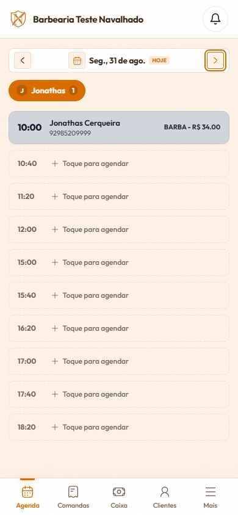
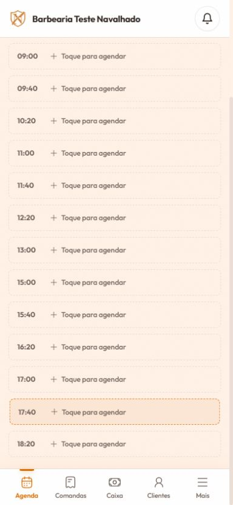

# Snapshot operacional — Spec 023: disponibilidade dinâmica da Agenda

**Data da validação:** 30/08/2026  (America/Manaus)
**Ambiente funcional:** DEV — `https://dev.navalhado.com.br/agenda`
**Commit de código validado:** `a090c29` (`dev`)
**Status:** funcional e validado com testes automatizados, build e navegador integrado

## Escopo confirmado

- O tenant continua sendo a fonte dinâmica da abertura, fechamento, intervalo da grade e antecedência.
- A escala individual do profissional define o horário efetivo exibido, sempre limitada pelo expediente do tenant.
- A pausa aceita horários exatos, sem obrigar alinhamento ao intervalo da grade.
- Depois do retorno da pausa, a grade retoma a partir do horário de retorno e avança conforme o intervalo configurado.
- O fechamento limita o início do slot, não exige que a duração do serviço termine antes do fechamento.
- Com retorno às `15:00`, intervalo de `40` minutos e fechamento às `19:00`, o último slot é `18:20`; `18:40` não é exibido.
- Com retorno às `14:00`, os slots seguem a nova configuração dinâmica e podem chegar a `18:40`.
- A duração efetiva considera o serviço e, quando configurada, a duração personalizada do profissional.
- A opção `Tanto faz` permanece disponível quando existe profissional compatível.
- O fluxo de encaixes não foi alterado.

## Evidências automatizadas

- Vitest: `53` arquivos e `300` testes aprovados.
- Build de produção: concluído com sucesso; permaneceu somente o aviso já conhecido de tamanho de bundle.
- Testes específicos cobrem opções de horários exatos, retorno de pausa, duração efetiva e último slot `18:20`.

## Evidências no DEV

Validação somente leitura no navegador integrado, sem salvar configurações, criar agendamentos ou alterar dados:

- Mobile `390×844`: segunda-feira com slots `10:40`, `11:20`, `12:00`, `15:00`, `15:40`, `16:20`, `17:00`, `17:40` e `18:20`.
- A transição confirma que os horários durante a pausa não aparecem e que o retorno começa exatamente em `15:00`.
- O último slot exibido é `18:20`; não aparece `18:40`.
- O modal de `18:20` foi aberto com sucesso e exibiu a opção `Tanto faz`.
- A inspeção anterior também confirmou no DEV os seletores de configuração em precisão de 5 minutos, incluindo `12:00` e `14:00`, sem submeter alteração.

### Prints registrados

## Banco e migrations

- A implementação não exigiu alteração de schema, função ou dado persistido; portanto, não houve migration nova.
- O contrato Supabase existente foi preservado: disponibilidade dinâmica, timezone, antecedência, conflitos e duração personalizada continuam sendo calculados no domínio já existente.
- Não houve escrita em PROD. A validação do banco foi somente leitura e restrita ao DEV quando necessária.

## Tickets

- Tickets `01` a `05`: finalizados.
- Ticket `06`: finalizado com fallback manual no navegador DEV; Playwright não foi executado nesta etapa.

## Limitações registradas

- Não foi salva uma nova configuração `12:00–14:00` no tenant DEV para evitar mutação de dados de homologação. A preservação do formato é coberta pelos testes e pela leitura dos controles existentes.
- O print que faltava era o da transição do intervalo; ele foi adicionado acima. Os demais cenários já possuíam evidência automatizada ou visual.
